### Class Diagram of Elements
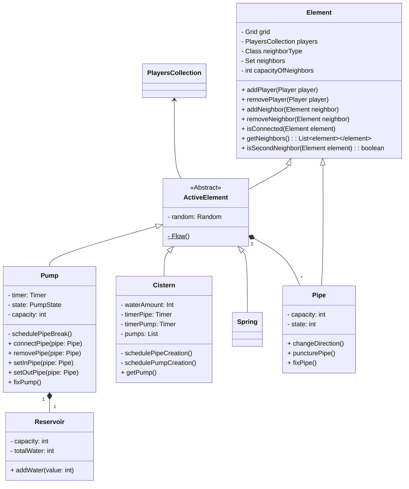
```mermaid

classDiagram
	class Element {
        - Grid grid
        - PlayersCollection players
        - Class<?> neighborType
        - Set neighbors
        - int capacityOfNeighbors
        + addPlayer(Player player)
        + removePlayer(Player player)
        + addNeighbor(Element neighbor)
        + removeNeighbor(Element neighbor)
        + isConnected(Element element)
        + getNeighbors(): List<Element>
        + isSecondNeighbor(Element element): boolean
    }

  class Pump {
    - timer: Timer
    - state: PumpState
	- capacity: int
    - schedulePipeBreak()
    + connectPipe(pipe: Pipe)
    + removePipe(pipe: Pipe)
    + setInPipe(pipe: Pipe)
    + setOutPipe(pipe: Pipe)
    + fixPump()
  }
  class Reservoir {
    - capacity: int
    - totalWater: int
    + addWater(value: int)
  }
  
  class ActiveElement {
    - random: Random
    - Flow()$
  }
  <<Abstract>> ActiveElement
  class Cistern {
    - waterAmount: Int
    - timerPipe: Timer
    - timerPump: Timer
    - pumps: List
    - schedulePipeCreation()
    - schedulePumpCreation()
    + getPump()    
  }
  class Pipe {
    - capacity: int
	- state: int
    + changeDirection()
	+ puncturePipe()
    + fixPipe()
  }
  class Spring {
  }

PlayersCollection <-- ActiveElement
Element <|-- ActiveElement
Element <|-- Pipe
ActiveElement <|-- Pump
ActiveElement <|-- Cistern
ActiveElement <|-- Spring
ActiveElement "2" *-- "*" Pipe
Pump "1" *-- "1" Reservoir
```

### Class Diagram of Players
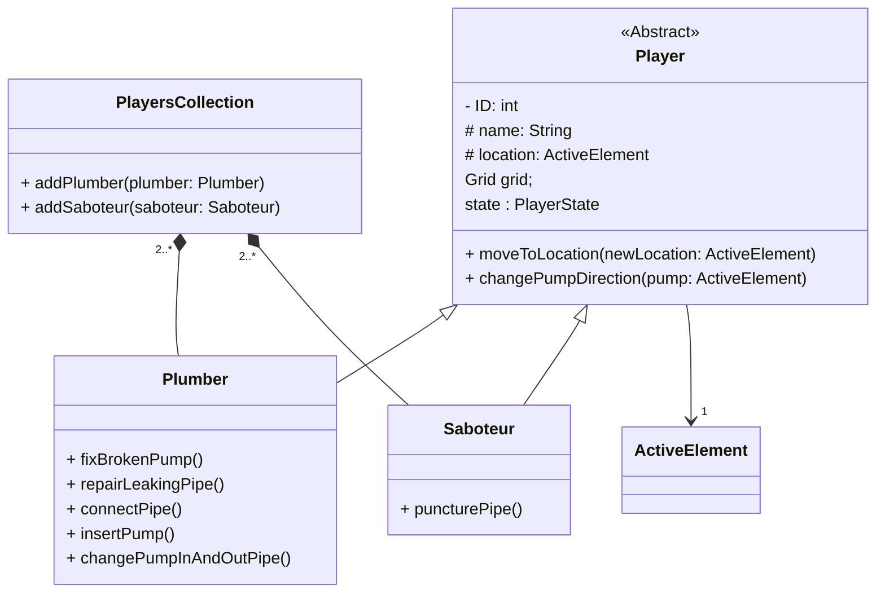
```mermaid
classDiagram
 class Player {
    - ID: int
    # name: String
    # location: ActiveElement
    Grid grid;
   state : PlayerState 
    + moveToLocation(newLocation: ActiveElement)
    + changePumpDirection(pump: ActiveElement)
  }
  <<Abstract>> Player
  
  class ActiveElement {
  }
  class Plumber {
    + fixBrokenPump()
    + repairLeakingPipe()
    + connectPipe()
    + insertPump()
    + changePumpInAndOutPipe()
  }
  class Saboteur {
    + puncturePipe()
  }
 class PlayersCollection {
    + addPlumber(plumber: Plumber)
    + addSaboteur(saboteur: Saboteur)
  }

  Player <|-- Plumber
  PlayersCollection "2..*" *--  Plumber
  PlayersCollection "2..*" *-- Saboteur
  Player <|-- Saboteur
  Player --> "1" ActiveElement

```

### Class Diagram of Grid

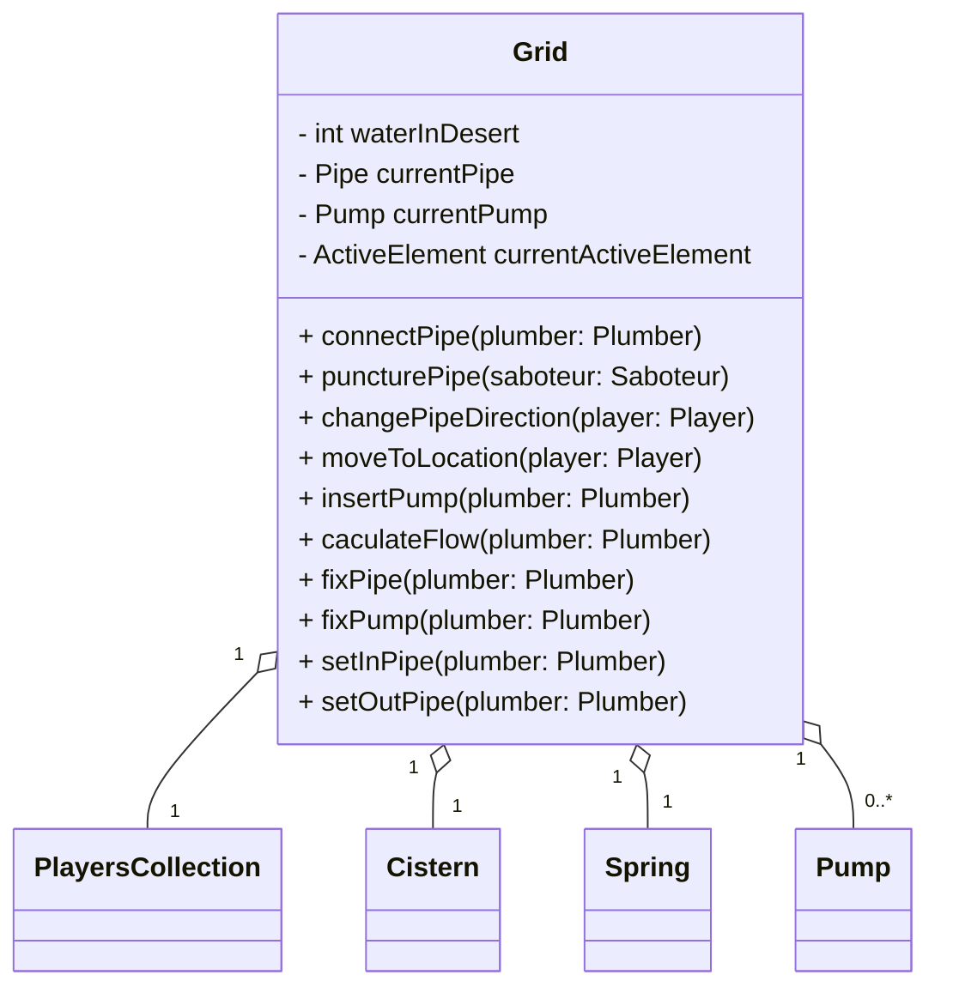
```mermaid
classDiagram
class Grid {
    - int waterInDesert
    - Pipe currentPipe
    - Pump currentPump
    - ActiveElement currentActiveElement
    + connectPipe(plumber: Plumber)
    + puncturePipe(saboteur: Saboteur)
    + changePipeDirection(player: Player)
    + moveToLocation(player: Player)
    + insertPump(plumber: Plumber)
    + caculateFlow(plumber: Plumber)
    + fixPipe(plumber: Plumber)
    + fixPump(plumber: Plumber)
    + setInPipe(plumber: Plumber)
    + setOutPipe(plumber: Plumber)
}
  class PlayersCollection {
  }
  class Cistern {
  }
  class Spring {
  }
  class Pump {
  }

  Grid "1" o-- "1" PlayersCollection
  Grid "1" o-- "1" Cistern
  Grid "1" o-- "1" Spring
  Grid "1" o-- "0..*" Pump

```


### Class Diagram of GUI
This is how they are associated with eachother.
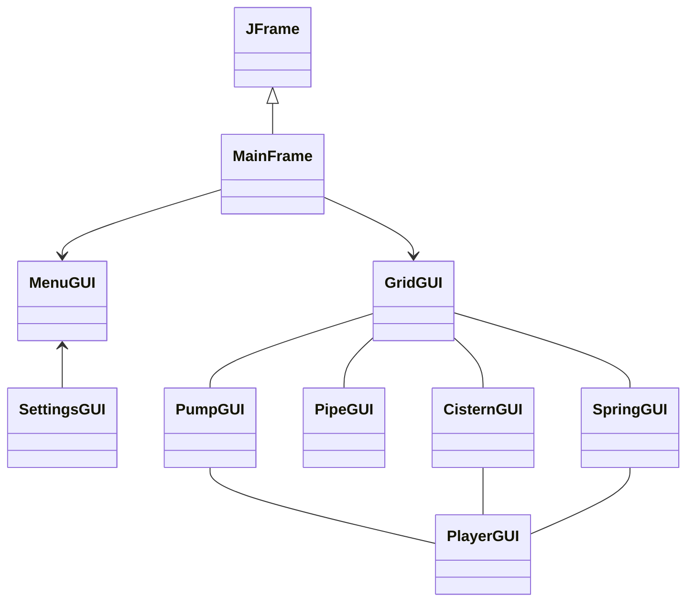
```mermaid
classDiagram
JFrame <|-- MainFrame  
MainFrame --> MenuGUI
MenuGUI <-- SettingsGUI
MainFrame --> GridGUI
GridGUI -- PumpGUI
GridGUI -- PipeGUI
GridGUI -- CisternGUI
GridGUI -- SpringGUI
PumpGUI -- PlayerGUI
CisternGUI -- PlayerGUI
SpringGUI -- PlayerGUI
```
Here can be an implementation of a GUI:
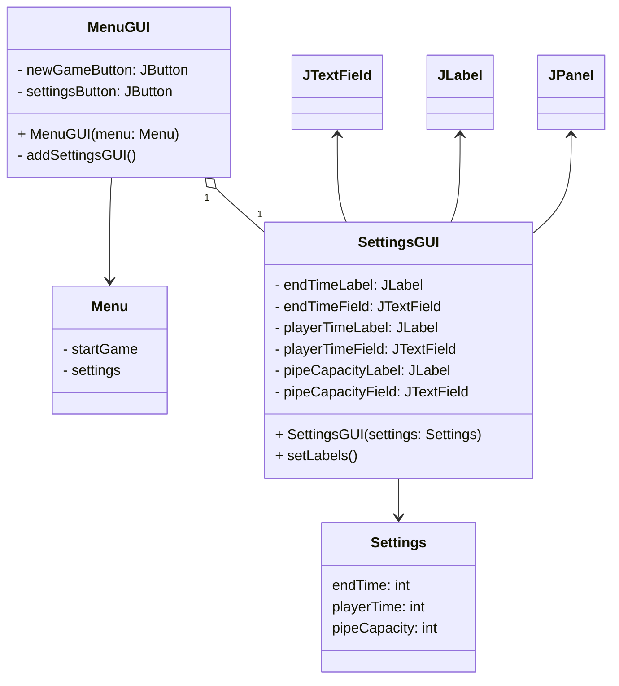
```mermaid
classDiagram
  class MenuGUI {
    - newGameButton: JButton
    - settingsButton: JButton
    + MenuGUI(menu: Menu)
    - addSettingsGUI()
  }
  class Menu {
    - startGame
    - settings
  }
class Settings{
    endTime: int
    playerTime: int
    pipeCapacity: int
}

class SettingsGUI{
    - endTimeLabel: JLabel
    - endTimeField: JTextField
    - playerTimeLabel: JLabel
    - playerTimeField: JTextField
    - pipeCapacityLabel: JLabel
    - pipeCapacityField: JTextField
    + SettingsGUI(settings: Settings)
    + setLabels()
}

SettingsGUI --> Settings
JPanel <-- SettingsGUI
JLabel <-- SettingsGUI
JTextField <-- SettingsGUI
MenuGUI  -->  Menu
MenuGUI "1" o-- "1" SettingsGUI

```
This is the inheritance graph of the GUI elements.

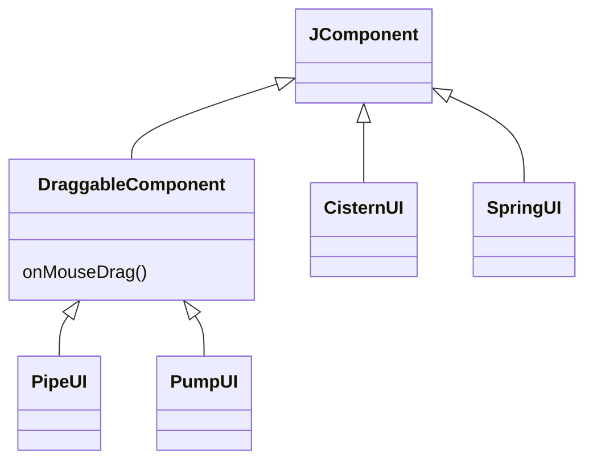
```mermaid
classDiagram
class DraggableComponent{
  onMouseDrag()
}
JComponent <|-- DraggableComponent
DraggableComponent <|-- PipeUI
DraggableComponent <|-- PumpUI
JComponent <|-- CisternUI
JComponent <|-- SpringUI
```

## Class Diagram of UI
Each corresponding element has its gui and its keyboard inputs which make the UI.
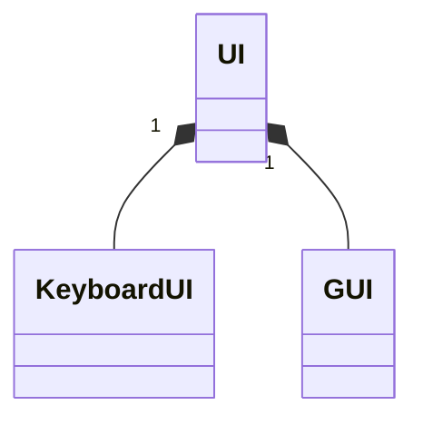
```mermaid
classDiagram
UI "1" *-- KeyboardUI
UI "1" *-- GUI
```
Example
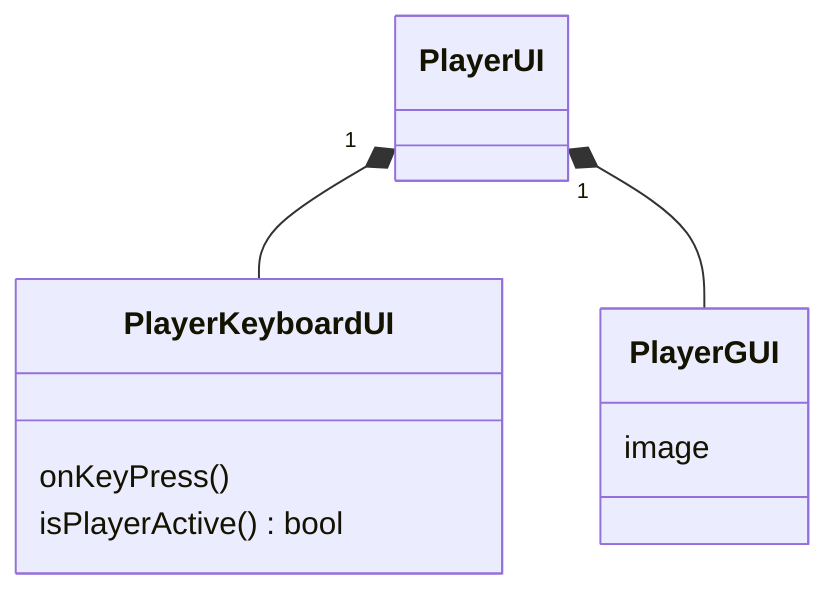
```mermaid
classDiagram

class PlayerGUI{
	image
}
class PlayerKeyboardUI{
	onKeyPress()
	isPlayerActive() bool
}

PlayerUI "1" *-- PlayerKeyboardUI
PlayerUI "1" *-- PlayerGUI
```

## Class Diagram of UI with Logic
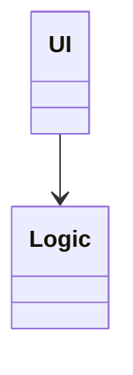
```mermaid
classDiagram
UI --> Logic
```
Example
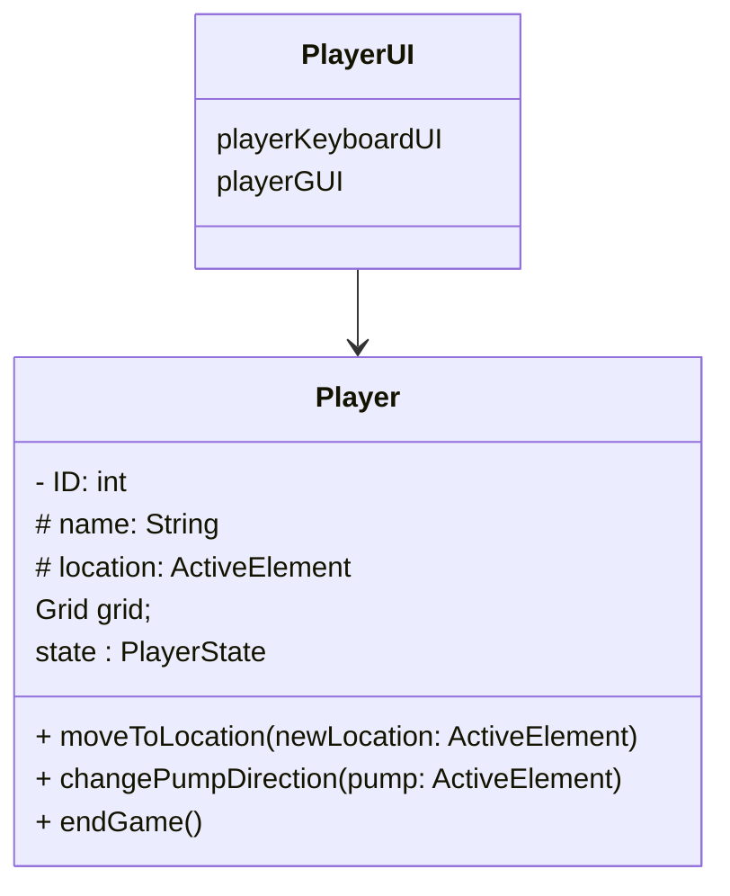
```mermaid
classDiagram
class PlayerUI{
	playerKeyboardUI
	playerGUI
}
 class Player {
    - ID: int
    # name: String
    # location: ActiveElement
    Grid grid;
   state : PlayerState 
    + moveToLocation(newLocation: ActiveElement)
    + changePumpDirection(pump: ActiveElement)
    + endGame()
  }
  PlayerUI --> Player
```

## Class Diagram of Menu
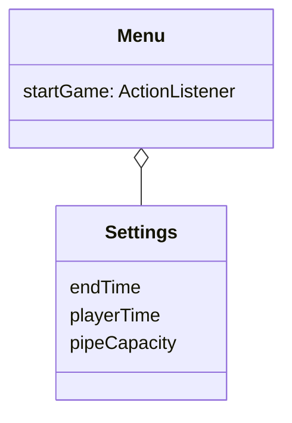
```mermaid
classDiagram
class Menu{
	startGame: ActionListener 
}
class Settings{
  endTime
  playerTime
  pipeCapacity
}
Menu o-- Settings
```

## A complete abstracted picture of the Class Diagarms
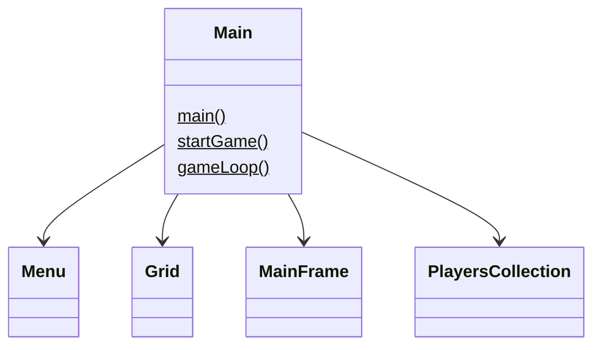
```mermaid
classDiagram
class Main{
	 main()$
	 startGame()$
	 gameLoop()$
}
Main --> Menu
Main --> Grid
Main --> MainFrame
Main --> PlayersCollection

```
The main inicializes both the UI and the Logic side
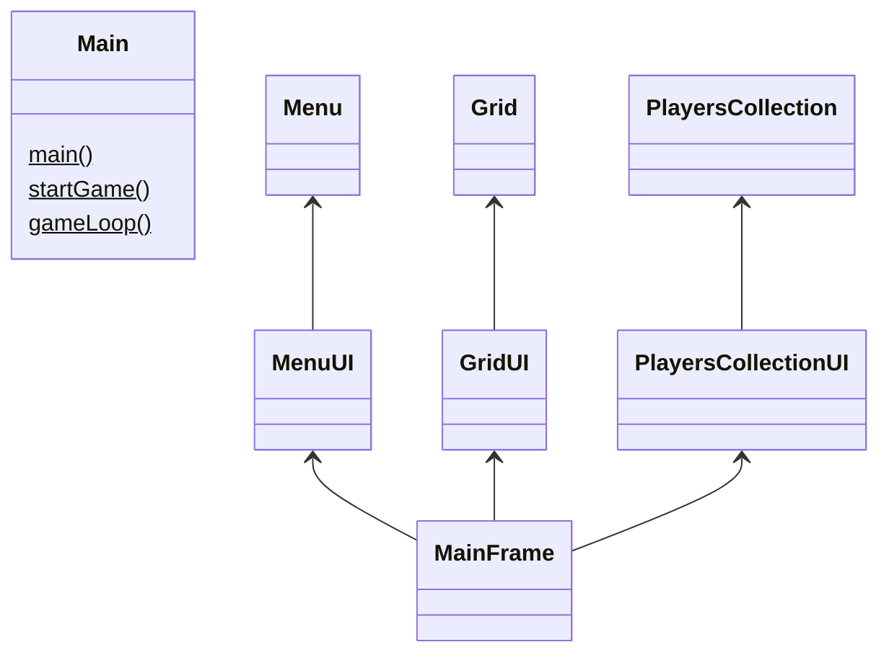
```mermaid
classDiagram
class Main{
	 main()$
	 startGame()$
	 gameLoop()$
}


Menu <-- MenuUI
Grid <-- GridUI
PlayersCollection <-- PlayersCollectionUI
MenuUI <-- MainFrame 
GridUI <-- MainFrame 
PlayersCollectionUI <-- MainFrame
```
Here the Menu, Grid, PlayersCollection are the Logic Side of the program.
And the its corresponding UI part is displayed using the mainFrame.
# Players
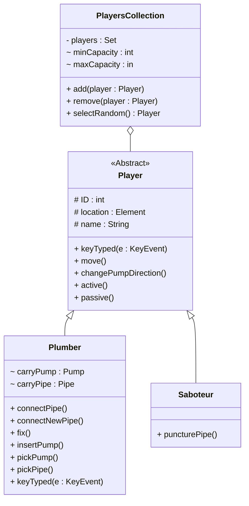
```mermaid
classDiagram
    class PlayersCollection{
        - players : Set<Player>
        ~ minCapacity : int
        ~ maxCapacity : in
        + add(player : Player) 
        + remove(player : Player) 
        + selectRandom() Player
    }
    class Player{
        <<Abstract>>
        # ID : int
        # location : Element
        # name : String
        + keyTyped(e : KeyEvent) 
        + move() 
        + changePumpDirection() 
        + active() 
        + passive() 
    }
    class Plumber{
        ~ carryPump : Pump
        ~ carryPipe : Pipe
        + connectPipe()
        + connectNewPipe() 
        + fix() 
        + insertPump() 
        + pickPump() 
        + pickPipe()
        + keyTyped(e : KeyEvent) 
    }
    class Saboteur{
        + puncturePipe()
    }
    PlayersCollection o-- Player
    Player <|-- Plumber
    Player <|-- Saboteur
    
```
Player --> "1" Element
Element --> "1" PlayersCollection
# Elements
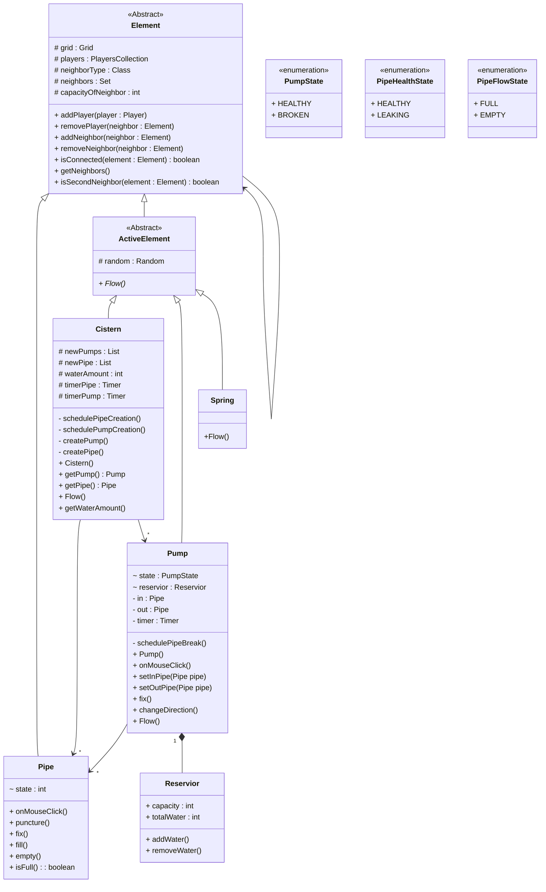
```mermaid
classDiagram
    class Element{
        <<Abstract>>
        # grid : Grid
        # players : PlayersCollection
        # neighborType : Class<?>
		# neighbors : Set
        # capacityOfNeighbor : int 
        + addPlayer(player : Player) 
        + removePlayer(neighbor : Element) 
        + addNeighbor(neighbor : Element) 
        + removeNeighbor(neighbor : Element) 
        + isConnected(element : Element) boolean
        + getNeighbors() 
        + isSecondNeighbor(element : Element) boolean
    }
    Element<|--Pipe
    class ActiveElement{
        <<Abstract>>
        # random : Random
        + Flow()*
    }
	Element<|--ActiveElement
	Element <--Element
	
    class Cistern{
        # newPumps : List<Pump>
        # newPipe : List<Pipe>
        # waterAmount : int
        # timerPipe : Timer 
        # timerPump : Timer
        - schedulePipeCreation()
        - schedulePumpCreation()
        - createPump()
        - createPipe()
        + Cistern()
        + getPump() Pump
        + getPipe() Pipe
        + Flow()
        + getWaterAmount()
    }
	ActiveElement<|--Cistern
	Cistern --> "*" Pipe
	Cistern --> "*" Pump
	
    class Pump{
        ~ state : PumpState
        ~ reservior : Reservior 
        - in : Pipe
        - out : Pipe
        - timer : Timer
        - schedulePipeBreak() 
        + Pump()
        + onMouseClick() 
        + setInPipe(Pipe pipe)
        + setOutPipe(Pipe pipe)
        + fix()
        + changeDirection()
        + Flow()
    }
    ActiveElement<|--Pump
    Pump --> "*"Pipe
	
    class Reservior{
        + capacity : int
        + totalWater : int
        + addWater() 
        + removeWater()
    }
	Pump "1" *-- Reservior


    class Spring{
		+Flow()
    }
    ActiveElement<|--Spring


    class Pipe{
        ~ state : int 
        + onMouseClick() 
        + puncture() 
        + fix() 
        + fill()
        + empty()
        + isFull(): boolean
    }
    
    
    class PumpState{
        <<enumeration>>
        + HEALTHY
        + BROKEN
    }

    class PipeHealthState{
        <<enumeration>>
        + HEALTHY
        + LEAKING
    }
    class PipeFlowState{
        <<enumeration>>
        + FULL
        + EMPTY
    }
```
ActiveElement --> Grid
# GRID
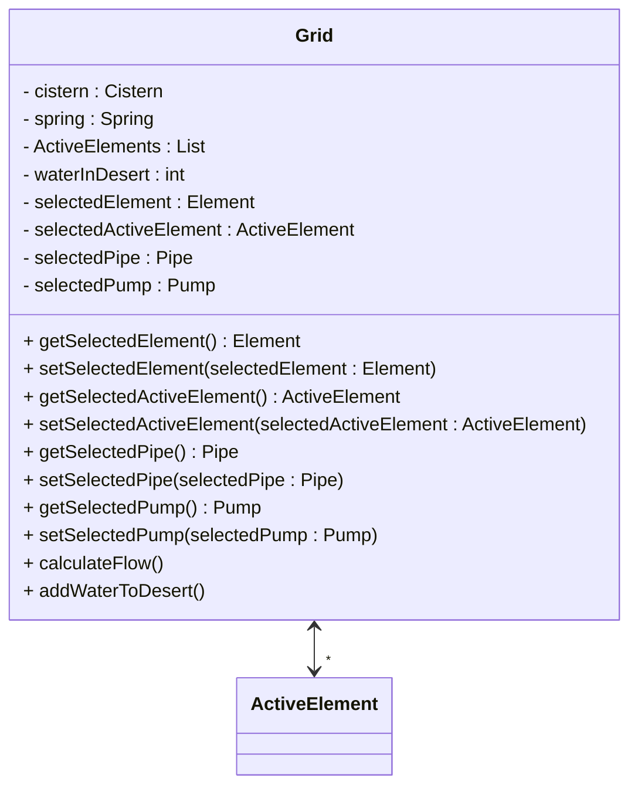
```mermaid
classDiagram
    class Grid{
        - cistern : Cistern
        - spring : Spring
        - ActiveElements : List
        - waterInDesert : int
        - selectedElement : Element
        - selectedActiveElement : ActiveElement
        - selectedPipe : Pipe 
        - selectedPump : Pump
        + getSelectedElement() Element
        + setSelectedElement(selectedElement : Element) 
        + getSelectedActiveElement() ActiveElement
        + setSelectedActiveElement(selectedActiveElement : ActiveElement)
        + getSelectedPipe() Pipe
        + setSelectedPipe(selectedPipe : Pipe) 
        + getSelectedPump() Pump 
        + setSelectedPump(selectedPump : Pump) 
        + calculateFlow() 
        + addWaterToDesert()
    }
    Grid <--> "*"   ActiveElement
```

# Main
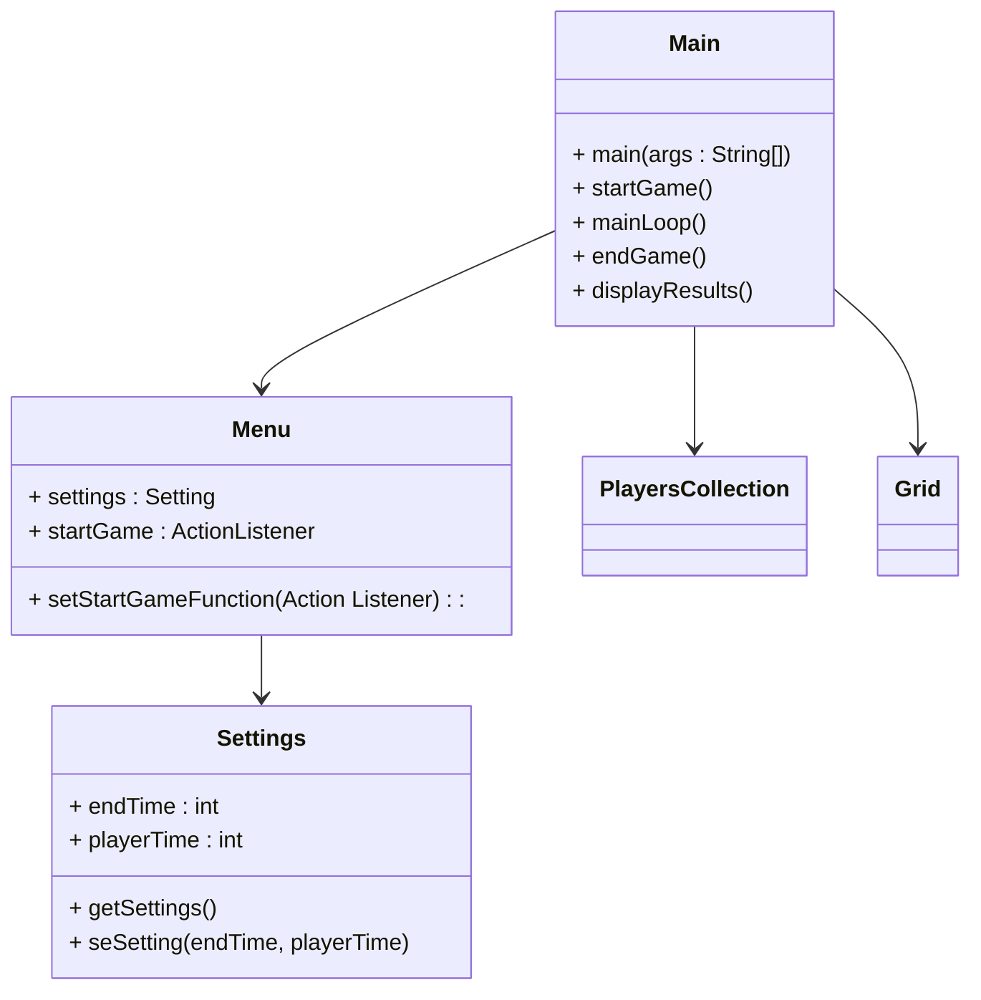
```mermaid
classDiagram
    class Main{
        + main(args : String[])
        + startGame()
        + mainLoop() 
        + endGame()
        + displayResults() 
    }

    class Menu{
        + settings : Setting
        + startGame : ActionListener
        + setStartGameFunction(Action Listener):
    }

    class Settings{
        + endTime : int 
        + playerTime : int 
        + getSettings()
        + seSetting(endTime, playerTime)
    }
    Main --> Menu
    Main --> PlayersCollection
    Menu --> Settings
    Main --> Grid
```

# All
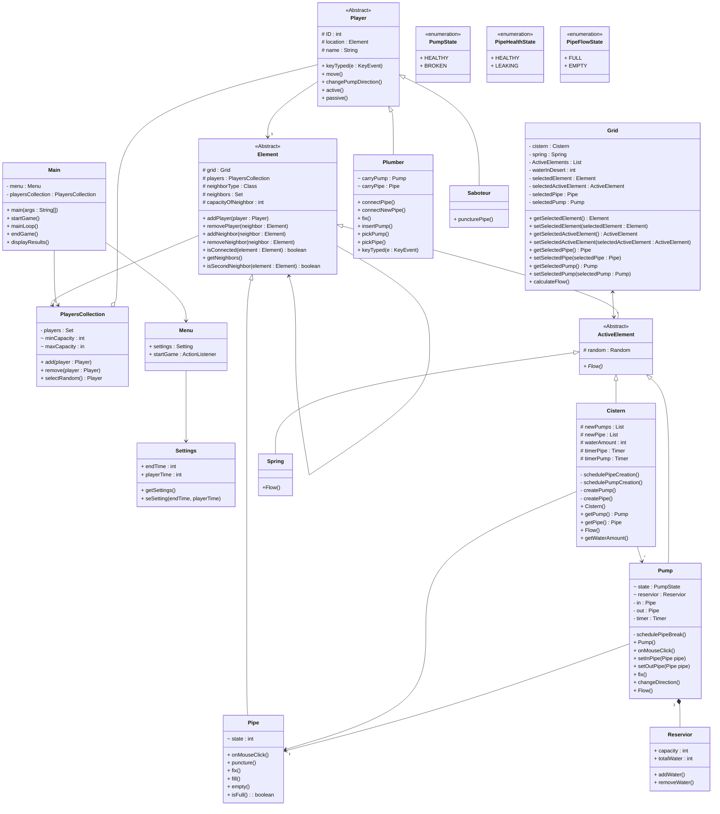
```mermaid
classDiagram
	Player --> "1" Element
	Element --> "1" PlayersCollection
    class Main{
        - menu : Menu
        - playersCollection : PlayersCollection
        + main(args : String[])
        + startGame()
        + mainLoop() 
        + endGame()
        + displayResults() 
    }

    class Menu{
        + settings : Setting
        + startGame : ActionListener
    }

    class Settings{
        + endTime : int 
        + playerTime : int 
        + getSettings()
        + seSetting(endTime, playerTime)
    }
    Main --> Menu
    Main --> PlayersCollection
    Menu --> Settings
    
    class Grid{
        - cistern : Cistern
        - spring : Spring
        - ActiveElements : List
        - waterInDesert : int
        - selectedElement : Element
        - selectedActiveElement : ActiveElement
        - selectedPipe : Pipe 
        - selectedPump : Pump
        + getSelectedElement() Element
        + setSelectedElement(selectedElement : Element) 
        + getSelectedActiveElement() ActiveElement
        + setSelectedActiveElement(selectedActiveElement : ActiveElement)
        + getSelectedPipe() Pipe
        + setSelectedPipe(selectedPipe : Pipe) 
        + getSelectedPump() Pump 
        + setSelectedPump(selectedPump : Pump) 
        + calculateFlow() 
    }
    Grid <--> "*"   ActiveElement

    class Element{
        <<Abstract>>
        # grid : Grid
        # players : PlayersCollection
        # neighborType : Class<?>
		# neighbors : Set
        # capacityOfNeighbor : int 
        + addPlayer(player : Player) 
        + removePlayer(neighbor : Element) 
        + addNeighbor(neighbor : Element) 
        + removeNeighbor(neighbor : Element) 
        + isConnected(element : Element) boolean
        + getNeighbors() 
        + isSecondNeighbor(element : Element) boolean
    }
    Element<|--Pipe
    class ActiveElement{
        <<Abstract>>
        # random : Random
        + Flow()*
    }
	Element<|--ActiveElement
	Element <--Element
	
    class Cistern{
        # newPumps : List<Pump>
        # newPipe : List<Pipe>
        # waterAmount : int
        # timerPipe : Timer 
        # timerPump : Timer
        - schedulePipeCreation()
        - schedulePumpCreation()
        - createPump()
        - createPipe()
        + Cistern()
        + getPump() Pump
        + getPipe() Pipe
        + Flow()
        + getWaterAmount()
    }
	ActiveElement<|--Cistern
	Cistern --> "*" Pipe
	Cistern --> "*" Pump
	
    class Pump{
        ~ state : PumpState
        ~ reservior : Reservior 
        - in : Pipe
        - out : Pipe
        - timer : Timer
        - schedulePipeBreak() 
        + Pump()
        + onMouseClick() 
        + setInPipe(Pipe pipe)
        + setOutPipe(Pipe pipe)
        + fix()
        + changeDirection()
        + Flow()
    }
    ActiveElement<|--Pump
    Pump --> "*"Pipe
	
    class Reservior{
        + capacity : int
        + totalWater : int
        + addWater() 
        + removeWater()
    }
	Pump "1" *-- Reservior


    class Spring{
		+Flow()
    }
    ActiveElement<|--Spring


    class Pipe{
        ~ state : int 
        + onMouseClick() 
        + puncture() 
        + fix() 
        + fill()
        + empty()
        + isFull(): boolean
    }
    
    
    class PumpState{
        <<enumeration>>
        + HEALTHY
        + BROKEN
    }

    class PipeHealthState{
        <<enumeration>>
        + HEALTHY
        + LEAKING
    }
    class PipeFlowState{
        <<enumeration>>
        + FULL
        + EMPTY
    }

    class PlayersCollection{
        - players : Set<Player>
        ~ minCapacity : int
        ~ maxCapacity : in
        + add(player : Player) 
        + remove(player : Player) 
        + selectRandom() Player
    }
    class Player{
        <<Abstract>>
        # ID : int
        # location : Element
        # name : String
        + keyTyped(e : KeyEvent) 
        + move() 
        + changePumpDirection() 
        + active() 
        + passive() 
    }
    class Plumber{
        ~ carryPump : Pump
        ~ carryPipe : Pipe
        + connectPipe()
        + connectNewPipe() 
        + fix() 
        + insertPump() 
        + pickPump() 
        + pickPipe()
        + keyTyped(e : KeyEvent) 
    }
    class Saboteur{
        + puncturePipe()
    }
    PlayersCollection o-- Player
    Player <|-- Plumber
    Player <|-- Saboteur
```


```The Grid serves as the structural foundation of the Pipe system, intricately connecting springs, pumps, pipes, and cisterns to form a cohesive network designed for the efficient extraction, movement, and collection of water.

Grid can regulate:

- Player Interaction with Pipes: Only one player can interact with a pipe at any given time. Plumbers have the ability to repair damage to pipes or modify the system by cutting a pipe and installing a pump. Conversely, saboteurs can create leaks by puncturing the pipes, disrupting the flow of water.

- Player Interaction with Pumps: Unlike pipes, pumps can be surrounded by any number of players. Both plumbers and saboteurs can alter the direction of water flow through these pumps. Additionally, plumbers can repair pumps if they are found to be BROKEN, ensuring the continuous movement of water through the system.

- Flow Management: The Grid is tasked with overseeing the flow of water throughout the network. This includes regulating the direction and volume of water from springs (the source) to the cistern (the sink), and managing any deviations caused by interactions with players or system failures.

- Network Integrity: It ensures the implementation of game regulations, maintaining the balance between construction and sabotage activities by players. This includes facilitating the addition of both simple (pipes) and active (pumps) elements to the system, and ensuring these additions adhere to the rules of the game.

- Dynamic Interaction: The Grid accommodates dynamic interactions within the network, allowing for the strategic placement of pumps by players, and the resultant alterations in water flow paths.

- Calculation and Display of Water Flow: It calculates the flow of water through each edge (pipe) of the network based on inputs from connected pumps or series of pipes. The Grid also identifies and nullifies the flow through any leaking pipes, preventing their contribution to downstream flow.

- Resource Accounting: By tracking water extracted from springs and water stored in the cistern, the Grid facilitates the calculation of water loss. This measurement is critical for determining the outcome of the game, as the comparison between stored and spilled water forms the basis for winning criteria.

  
In essence, the Grid is a sophisticated representation of a network flow problem with the added complexity of interactive elements (players) who can influence the system's efficiency and objectives. It orchestrates the flow of resources across the network, ensures compliance with game mechanics, and quantifies the results of these interactions to determine the game's outcome.
```