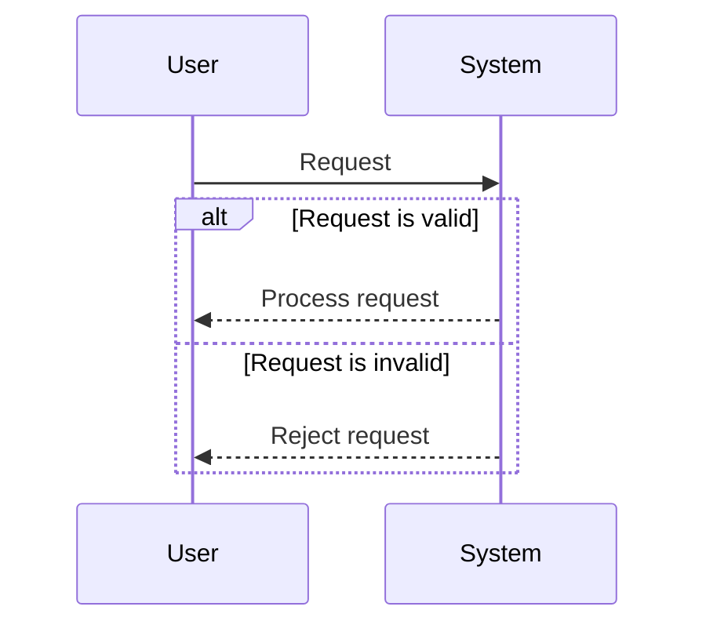

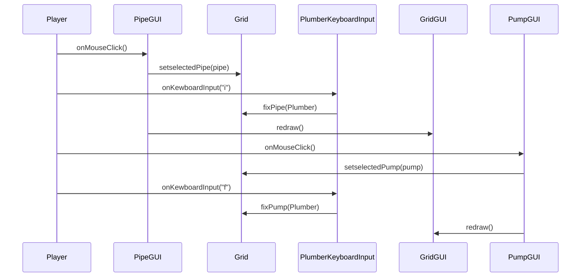

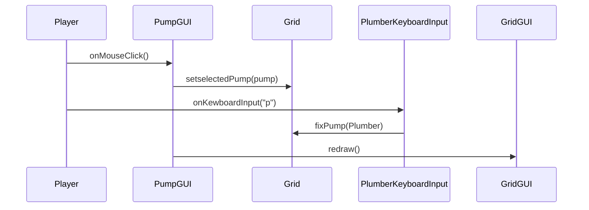

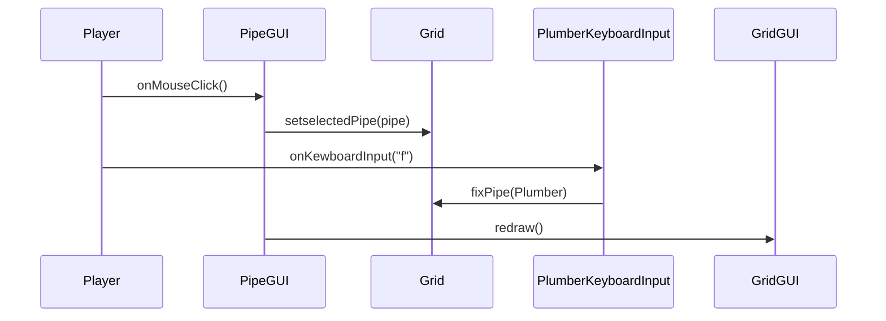

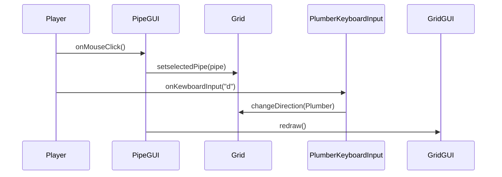


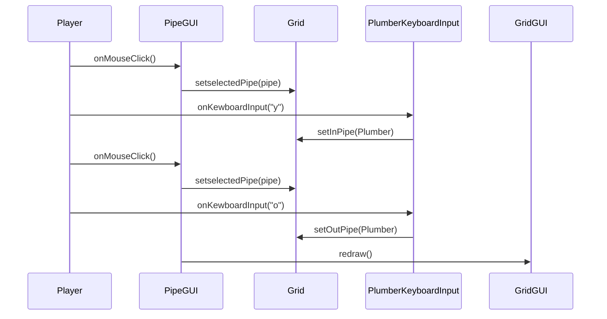

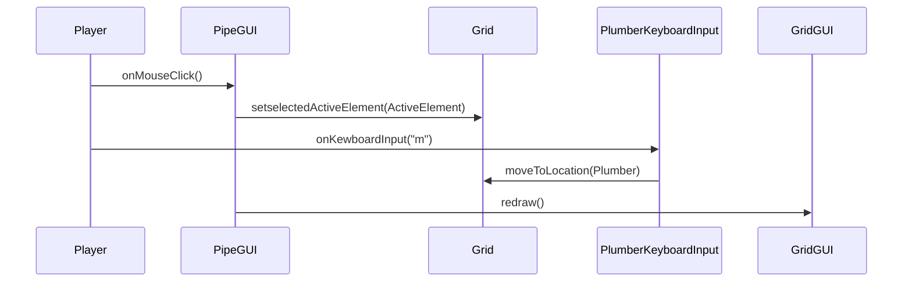

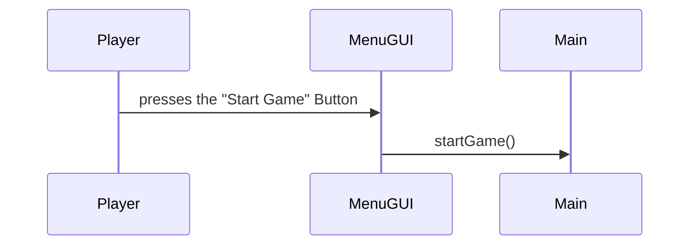

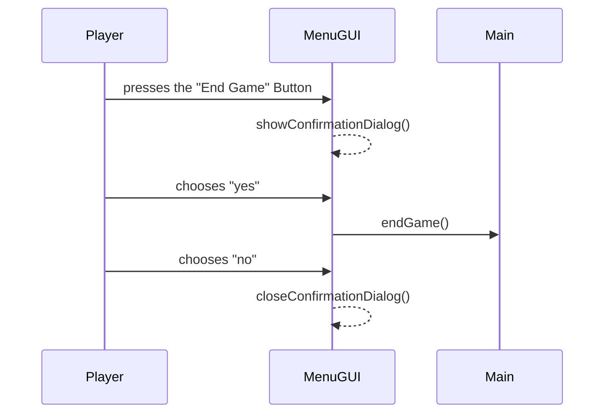

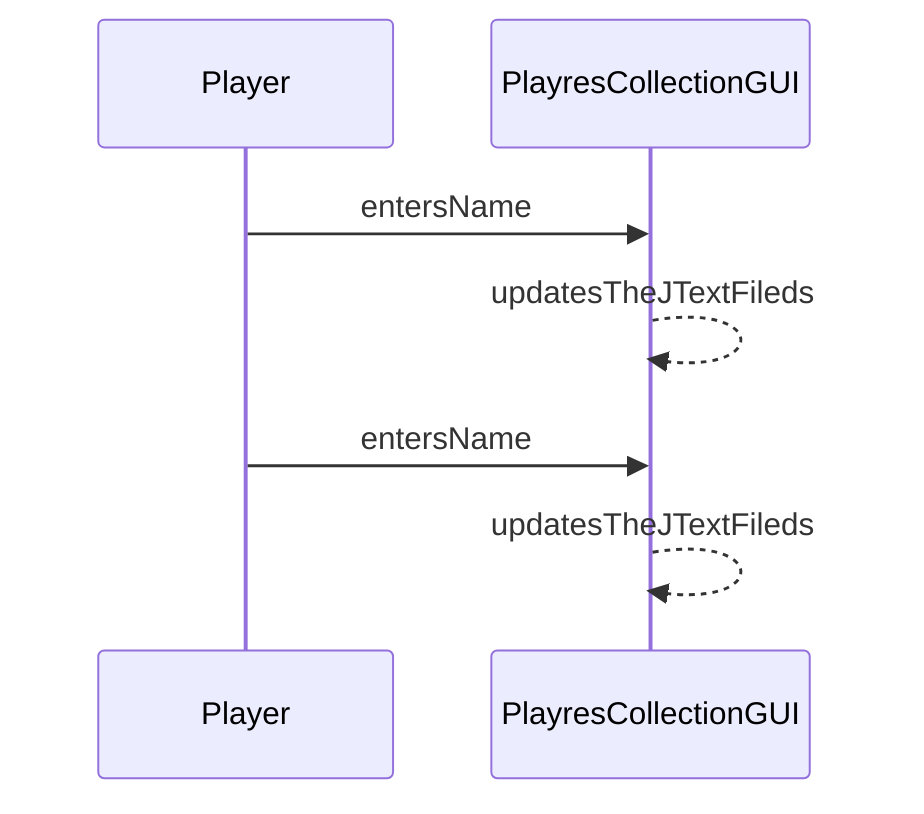


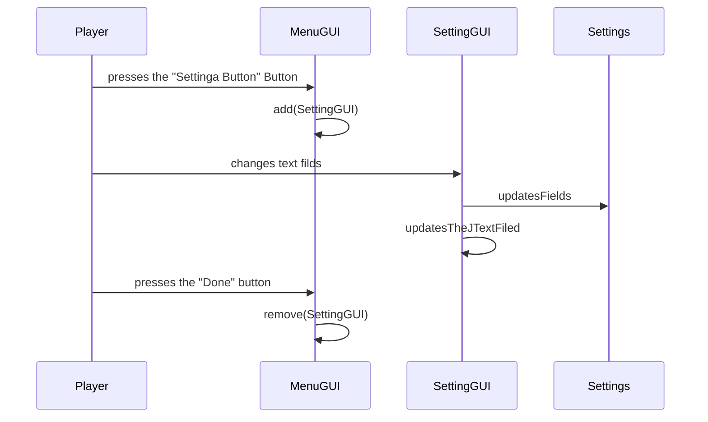


k
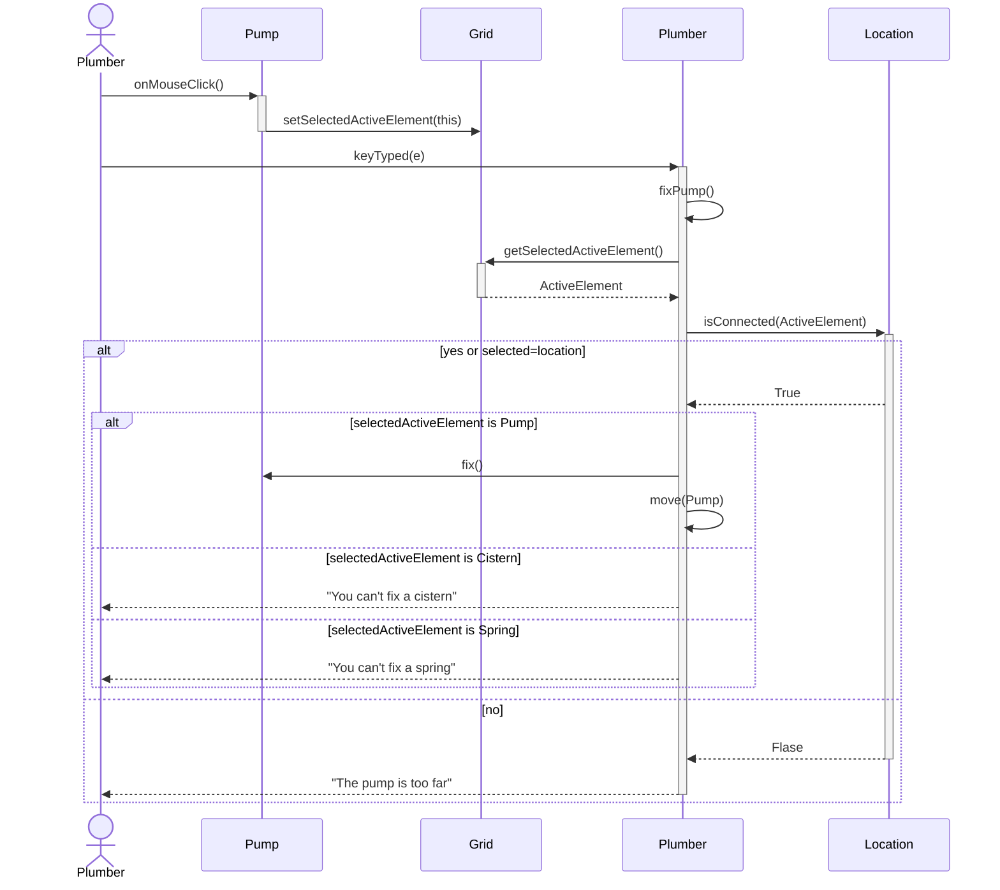
```java

```

### 4. Change Pipe Direction
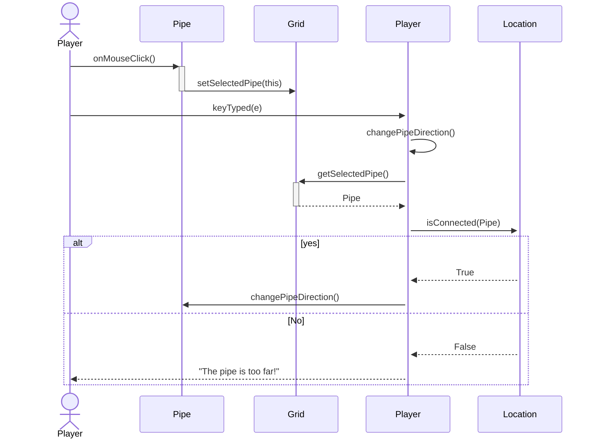

### 3. Fix Grid :: Repair Leaking Pipe
```mermaid
sequenceDiagram
    actor User as Plumber
    User->>+Pipe: onMouseClick()
    Pipe->>-Grid: setSelectedPipe(this)
    User->>+Plumber: keyTyped(e)
    Plumber->>Plumber: fix()
    Plumber->>+Grid: getSelectedPipe();
	Grid -->>-Plumber: Pipe;
    Plumber->>+Location: isConnected(Pipe)
    alt yes
	    Location-->>Plumber: True 
	    Plumber->>Pipe: fix()
    else No
	    Location-->>Plumber: False
        Plumber-->>-User: "The pipe is too far!"
    end
```p

```mermaid
sequenceDiagram
    actor User as Plumber
    User->>+Pipe: onMouseClick()
    Pipe->>-Grid: setSelectedPipe(this)
    User->>+Plumber: keyTyped(e)
    Plumber->>Plumber: fixPipe()
    Plumber->>+Grid: getSelectedPipe();
	Grid -->>-Plumber: Pipe;
	alt player has a pump
	    Plumber->>+Location: isConnected(Pipe)
	    alt yes
		    Location-->>Plumber: True 
		    create participant NewPipe
			Plumber->>NewPipe: new Pipe()
			Plumber->>+Pipe: getNext(location)
			Pipe-->>-Plumber: theNextACtiveElement
			Plumber->>NewPipe: addVertex(carryPump)
			Plumber->>NewPipe: addVertex(ActiveElement)
			Plumber->>carryPump: setInPipe(Pipe)
			Plumber->>carryPump: setOutPipe(NewPipe)
			Plumber->>Pipe: removeVertex(theNextACtiveElement)
			Plumber->>Pipe: addVertex(carryPump)
	    else No
		    Location-->>Plumber: False
	        Plumber-->>User: "The pipe is too far"
	    end
    else carryPump=null
		Plumber-->>-User: "You have no pump!"
	end
	
```