### 1.1 Connect Pipe :: Disconnect Pipe :: Put Pump in Pipe
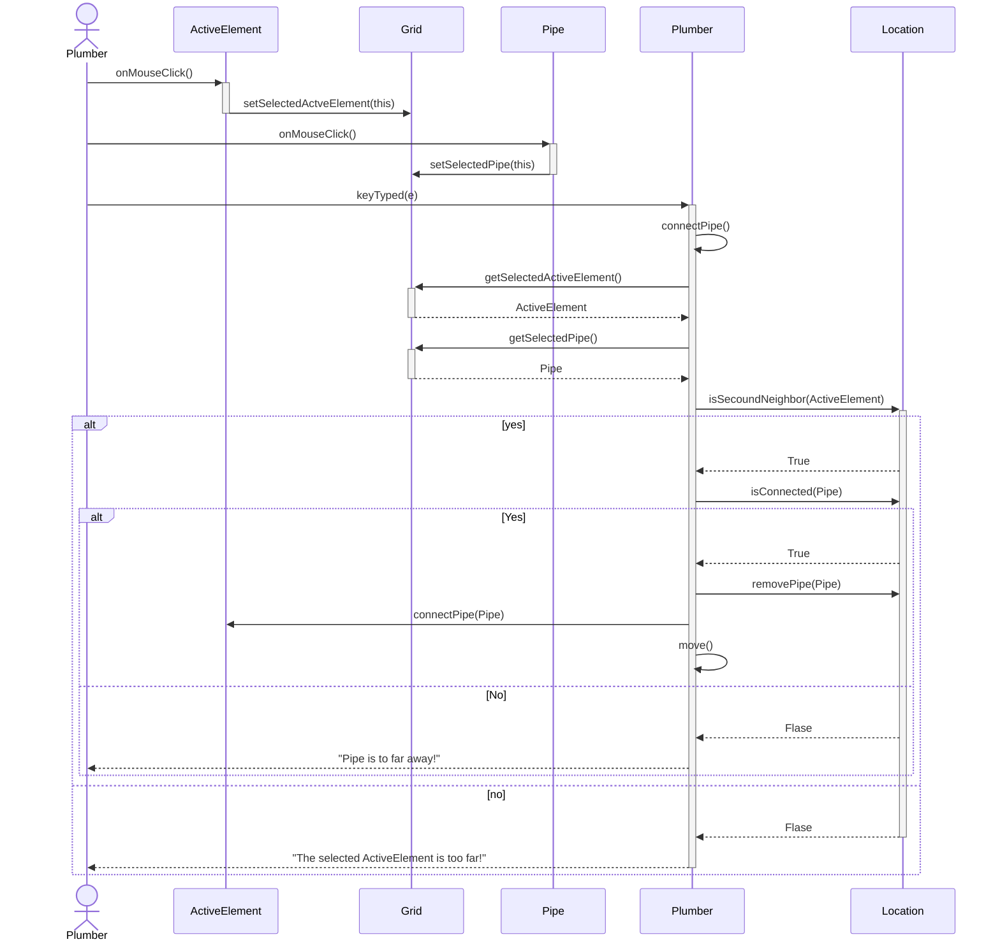
```mermaid
sequenceDiagram
	actor User  as Plumber
	User->>+ActiveElement: onMouseClick()
	ActiveElement->>-Grid: setSelectedActveElement(this)
	User->>+Pipe: onMouseClick()
	Pipe->>-Grid: setSelectedPipe(this)
	User->>+Plumber: keyTyped(e)
	Plumber->>Plumber:connectPipe()
	Plumber->>+Grid: getSelectedActiveElement()
	Grid-->>-Plumber: ActiveElement
	Plumber->>+Grid: getSelectedPipe();
	Grid -->>-Plumber: Pipe;
	Plumber->>+Location: isSecoundNeighbor(ActiveElement)
	alt yes
		Location-->>Plumber: True 	
		Plumber->>Location: isConnected(Pipe)
		alt Yes
			Location-->>Plumber: True 	
			Plumber->>Location: removePipe(Pipe)
			Plumber->>ActiveElement: connectPipe(Pipe)
			Plumber->>Plumber: move()
		else No
			Location-->>Plumber: Flase
			Plumber-->>User: "Pipe is to far away!"
		end
	else no
		Location-->>-Plumber: Flase
		Plumber-->>-User: "The selected ActiveElement is too far!"
	end
```
The user is a playing the plumber.
The event e here has e.getKeyChar()="c".
Note that the Pipe has become the selectedPipe.
This also includes picking up an end of pipe at a cistern.

### 1.2 Connect New Pipe
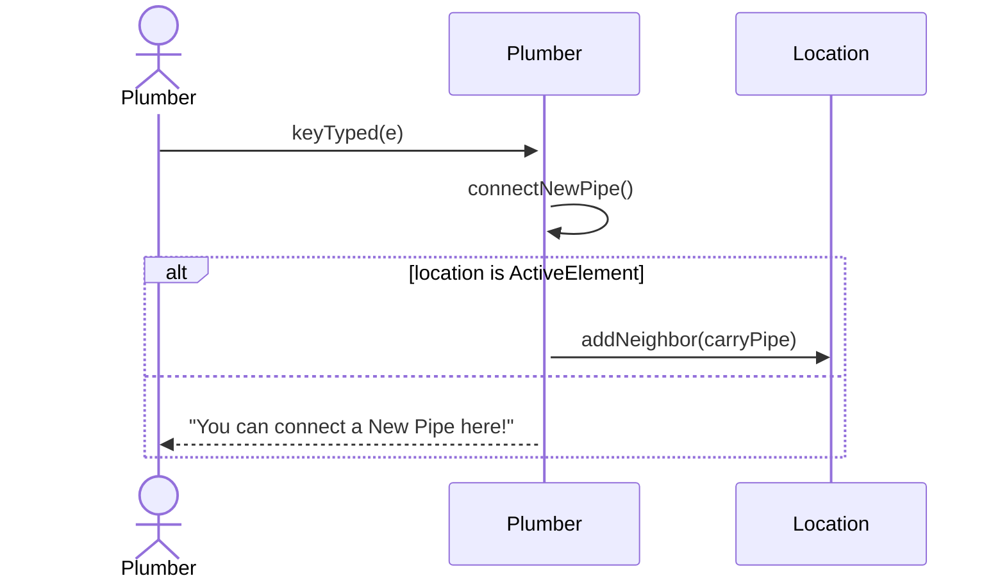
```mermaid
sequenceDiagram
    actor User as Plumber
    User->>+Plumber: keyTyped(e)
    Plumber->>Plumber: connectNewPipe()
    alt location is ActiveElement
        Plumber->>Location: addNeighbor(carryPipe)
    else 
        Plumber-->>User: "You can connect a New Pipe here!"
    end
```

### 2. Fix Grid :: Fix Broken Pump :: Repair Leaking Pipe
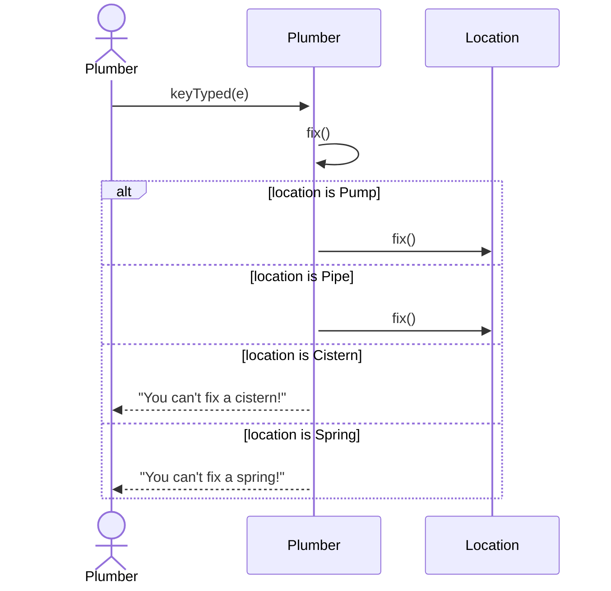
```mermaid
sequenceDiagram
    actor User as Plumber
    User->>+Plumber: keyTyped(e)
    Plumber->>Plumber: fix()
    alt location is Pump
        Plumber->>Location: fix()
    else location is Pipe
	    Plumber->>Location: fix()
    else location is Cistern
        Plumber-->>User: "You can't fix a cistern!"
    else location is Spring
        Plumber-->>User: "You can't fix a spring!"
    end
```
The event e here has e.getKeyChar()="f".

### 3. Change Pump Direction
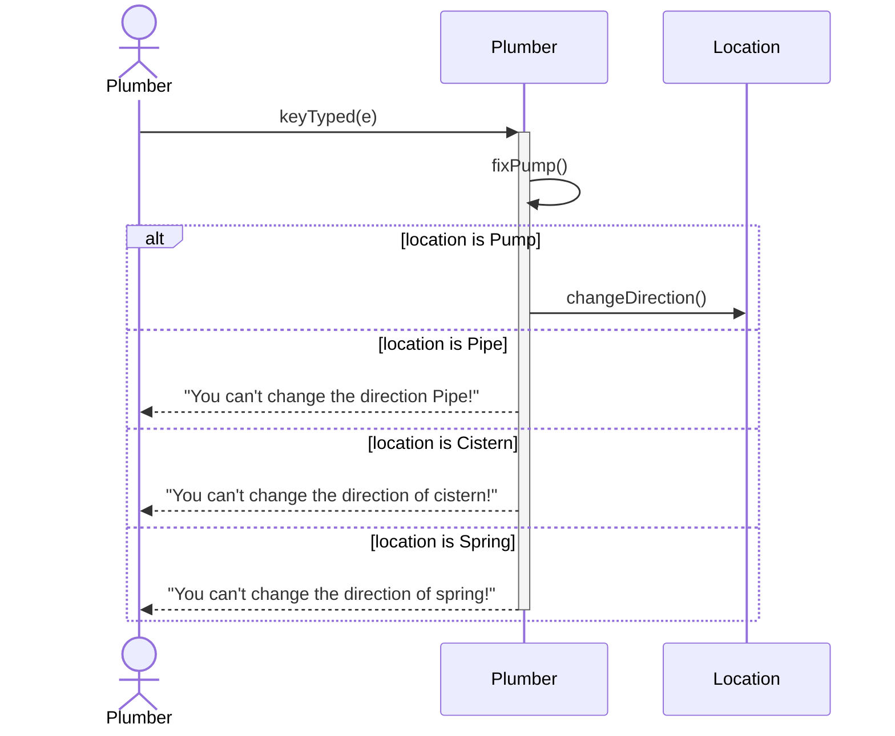
```mermaid
sequenceDiagram
    actor User as Plumber
    User->>+Plumber: keyTyped(e)
    Plumber->>Plumber: fixPump()
    alt location is Pump
        Plumber->>Location: changeDirection()
    else location is Pipe
	    Plumber-->>User: "You can't change the direction Pipe!"
    else location is Cistern
        Plumber-->>User: "You can't change the direction of cistern!"
    else location is Spring
        Plumber-->>-User: "You can't change the direction of spring!"
    end
```
The event e here has e.getKeyChar()="d"

### 4. Insert Pump
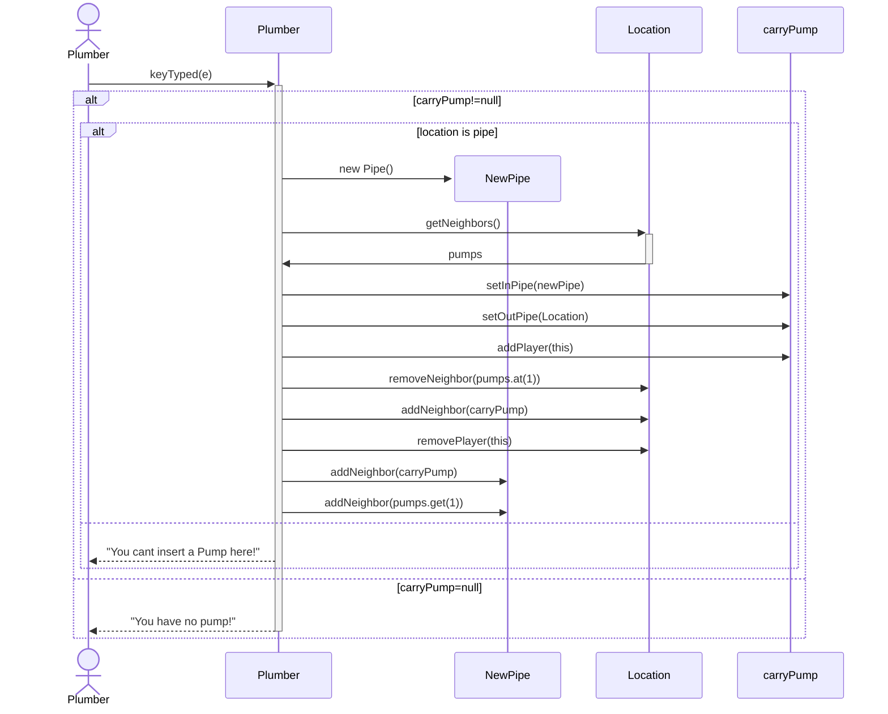
```mermaid
sequenceDiagram
    actor User as Plumber
    User->>+Plumber: keyTyped(e)
	alt carryPump!=null
		alt location is pipe
			create participant NewPipe
			Plumber->>NewPipe: new Pipe()
			Plumber->>+Location: getNeighbors()
			Location->>-Plumber: pumps
			Plumber->>carryPump: setInPipe(newPipe)
			Plumber->>carryPump: setOutPipe(Location)
			Plumber->>carryPump: addPlayer(this)
			Plumber->>Location: removeNeighbor(pumps.at(1))
			Plumber->>Location: addNeighbor(carryPump)
			Plumber->>Location: removePlayer(this)
			Plumber->>NewPipe: addNeighbor(carryPump)
			Plumber->>NewPipe: addNeighbor(pumps.get(1))
		else
			Plumber-->>User: "You cant insert a Pump here!"
		end
    else carryPump=null
		Plumber-->>-User: "You have no pump!"
	end
	
```
The event e here has e.getKeyChar()="i"

### 5.1 Pick Up Pump
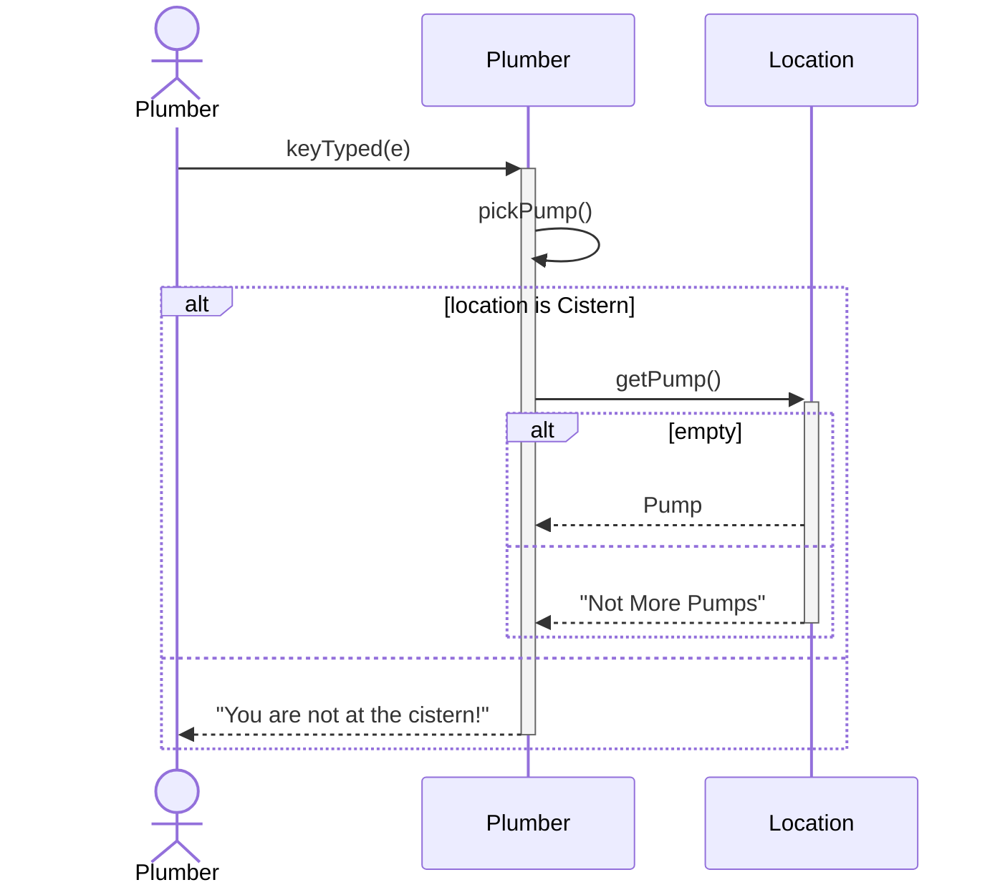
```mermaid
sequenceDiagram
    actor User as Plumber
    User->>+Plumber: keyTyped(e)
    Plumber->>Plumber: pickPump()
    alt location is Cistern
        Plumber->>+Location: getPump()
        alt empty
			Location-->>Plumber: Pump
        else 
	        Location-->>-Plumber: "Not More Pumps"
        end
    else 
        Plumber-->>-User: "You are not at the cistern!"
    end
```
### 5.2 Pick up New Pipe at Cistern 
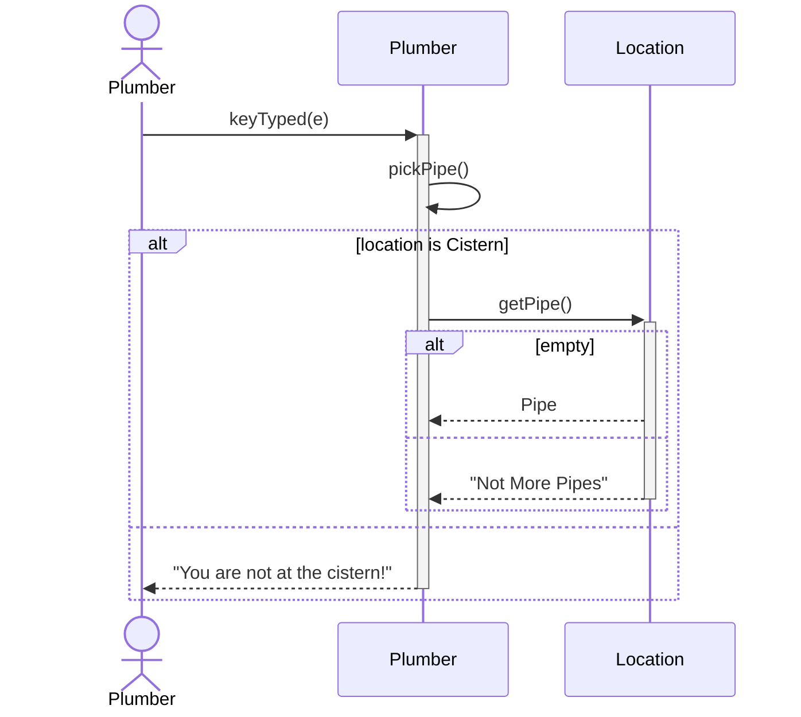
```mermaid
sequenceDiagram
    actor User as Plumber
    User->>+Plumber: keyTyped(e)
    Plumber->>Plumber: pickPipe()
    alt location is Cistern
        Plumber->>+Location: getPipe()
        alt empty
			Location-->>Plumber: Pipe
        else 
	        Location-->>-Plumber: "Not More Pipes"
        end
    else 
        Plumber-->>-User: "You are not at the cistern!"
    end

```

The event e here has e.getKeyChar()="p"
### 6. Puncture Pipe
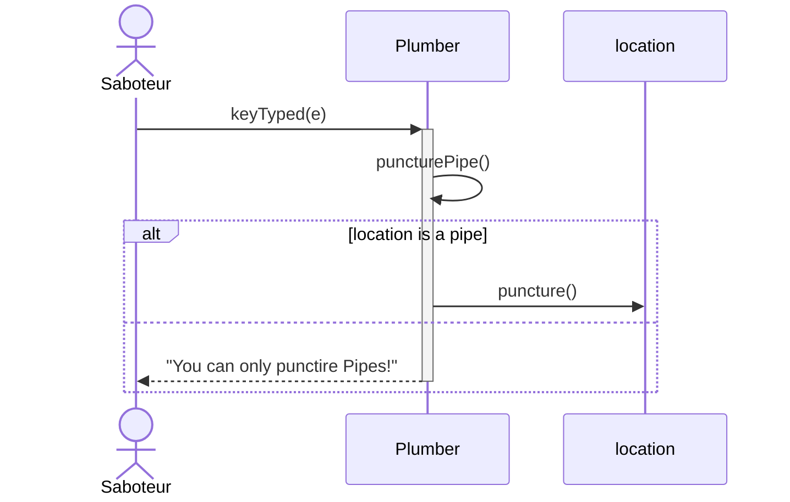
```mermaid
sequenceDiagram
    actor User as Saboteur
    User->>+Plumber: keyTyped(e)
    Plumber->>Plumber: puncturePipe()
    alt location is a pipe
	    Plumber->>location: puncture()
    else 
        Plumber-->>-User: "You can only punctire Pipes!"
    end
    
```
The event e here has e.getKeyChar()="p"

### 7. Move
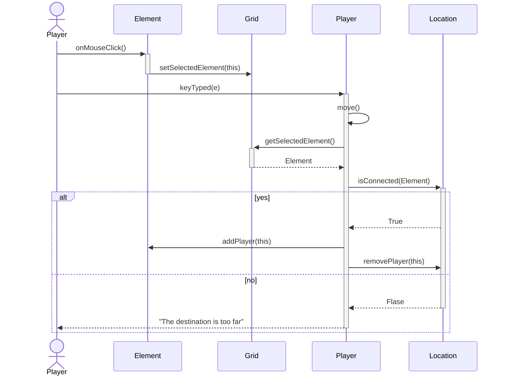
```mermaid
sequenceDiagram
    actor User as Player
    User->>+Element: onMouseClick()
    Element->>-Grid: setSelectedElement(this)
    User->>+Player: keyTyped(e)
    Player->>Player: move()
    Player->>+Grid: getSelectedElement()
	Grid-->>-Player: Element
	Player->>+Location: isConnected(Element)
    alt yes
	    Location-->>Player: True 
	    Player->>Element:addPlayer(this)
	    Player->>Location:removePlayer(this)
    else no
	    Location-->>-Player: Flase 
        Player-->>-User: "The destination is too far"
    end
```

The event e here has e.getKeyChar()="m"

### 8. Calculation :: Leakage of water
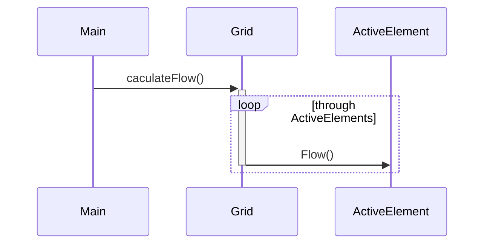
```mermaid
sequenceDiagram
	Main->>+Grid: caculateFlow();
	loop through ActiveElements
        Grid->>-ActiveElement: Flow()
    end
```
if ActiveElement is a Spring
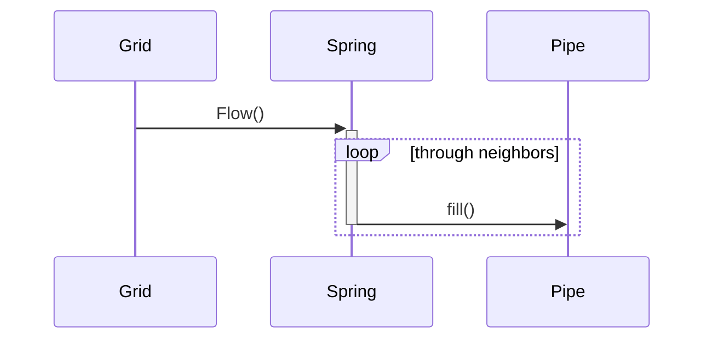
```mermaid
sequenceDiagram
    Grid->>+Spring: Flow()
	loop through neighbors
	    Spring->>-Pipe: fill()
	end
```
if ActiveElement is a Pump
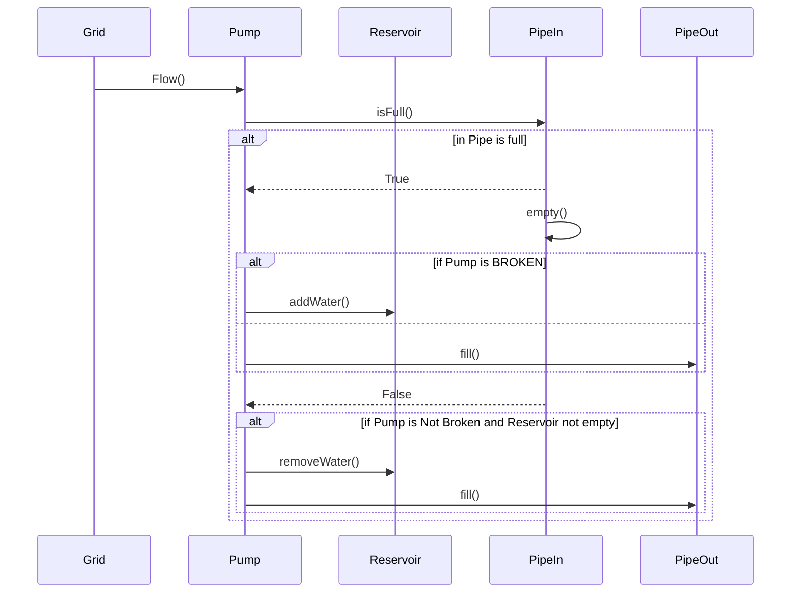
```mermaid
sequenceDiagram
	participant Grid
    participant Pump
    participant Reservoir
    participant PipeIn
    participant PipeOut
    Grid->>Pump: Flow()
	Pump->>PipeIn: isFull()
    alt in Pipe is full
        PipeIn-->>Pump: True
        PipeIn->>PipeIn: empty()
        alt if Pump is BROKEN
            Pump->>Reservoir: addWater()
        else
            Pump->>PipeOut: fill()
        end
        PipeIn-->>Pump: False
        alt if Pump is Not Broken and Reservoir not empty
            Pump->>Reservoir: removeWater()
            Pump->>PipeOut: fill()
        end
    end
```
if ActiveElement is a Cistern
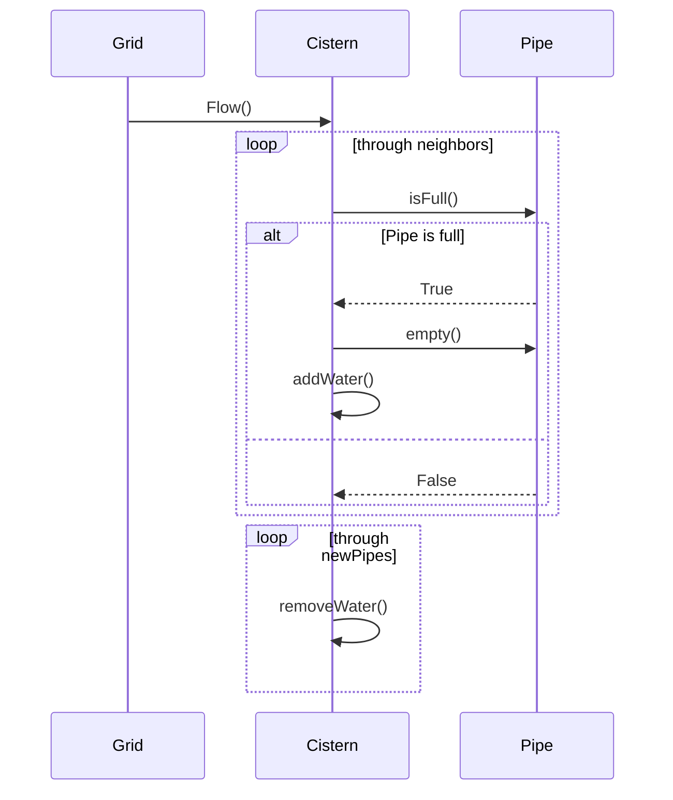
```mermaid
sequenceDiagram
	participant Grid
    participant Element as Cistern
    participant Pipe
	Grid->>Element: Flow()
    loop through neighbors
        Element->>Pipe: isFull()
        alt Pipe is full
	        Pipe-->>Element: True
            Element->>Pipe: empty()
            Element->>Element: addWater()
        else
	        Pipe-->>Element: False
        end
	        
    end

    loop through newPipes
        Element->>Element: removeWater()
    end
```

### 9. Start game
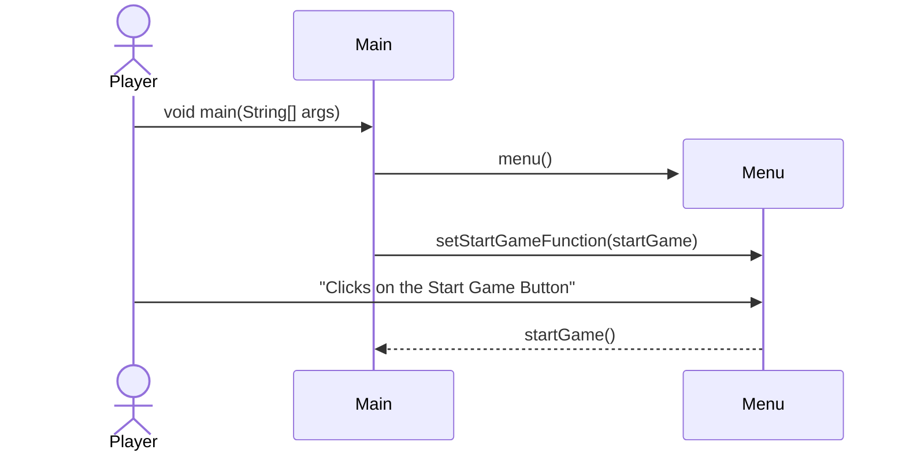
```mermaid
sequenceDiagram
	actor Player
	participant Main
	Player->>Main: void main(String[] args)
	create participant Menu
	Main->>Menu: menu()
	Main->>Menu: setStartGameFunction(startGame)
	Player->>Menu: "Clicks on the Start Game Button"
	Menu-->>Main: startGame()
```
### 10. Select Teams :: Main Loop
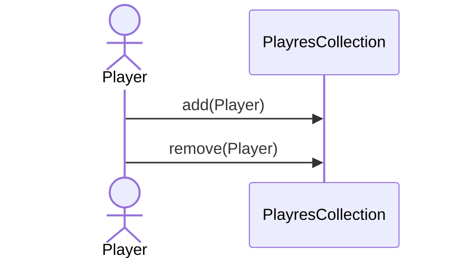
```mermaid
sequenceDiagram
	actor Player
    Player->>PlayresCollection: add(Player)
    Player->>PlayresCollection: remove(Player)
```

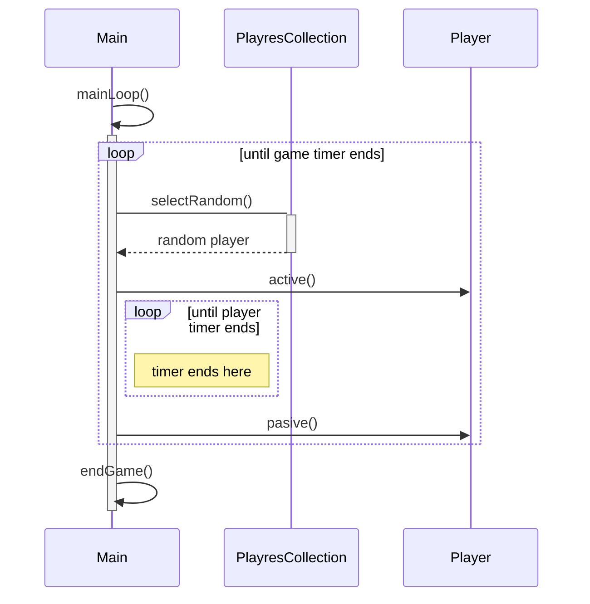
```mermaid
sequenceDiagram
	Main->>+Main: mainLoop()
    loop until game timer ends
        Main->+PlayresCollection: selectRandom()
        PlayresCollection-->>-Main: random player
        Main->>Player: active()
        loop until player timer ends
	        Note right of Main: timer ends here
        end
        Main->>Player: pasive()
    end
    Main->>-Main: endGame()
```
### 11. Change Settings
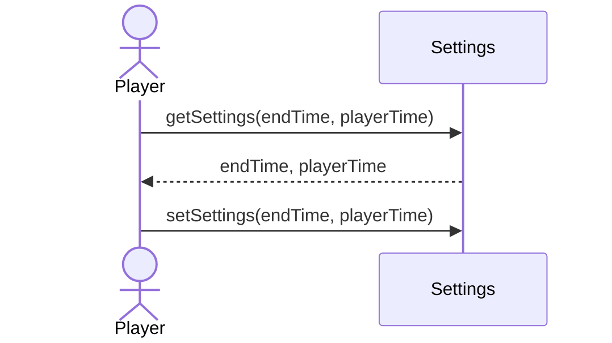
```mermaid
sequenceDiagram
	actor Player
	Player->>Settings: getSettings(endTime, playerTime)
	Settings-->>Player: endTime, playerTime 
	Player->>Settings: setSettings(endTime, playerTime)
```
### 12. End Game

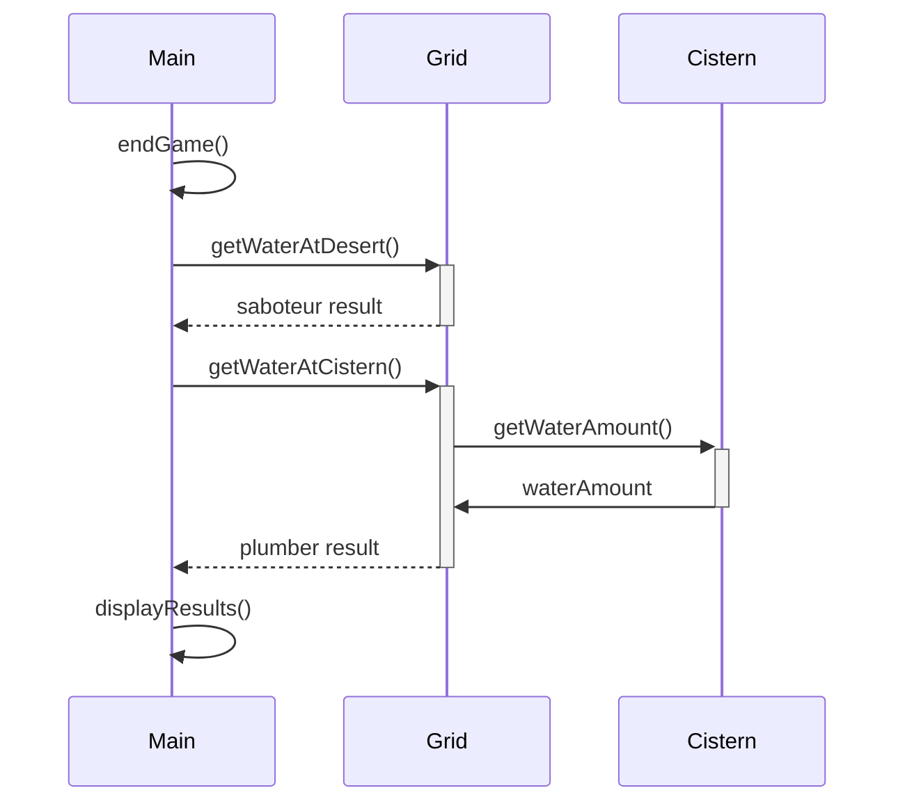
```mermaid
sequenceDiagram
    Main->>Main: endGame()
    Main->>+Grid: getWaterAtDesert()
    Grid-->>-Main: saboteur result
    Main->>+Grid: getWaterAtCistern()
    Grid->>+Cistern: getWaterAmount()
    Cistern->>-Grid: waterAmount
    Grid-->>-Main: plumber result
    Main->>Main: displayResults()
```

- [x] stepping on the elements (Move)
- [x] puncturing a pipe 
- [x] fixing a pipe
- [x] setting a direction of a pump
- [x] fixing a pump
- [x] pump is broken (not included)
- [x] disconnecting a pipe
- [x] connecting a pipe 
- [x] picking up a pump 
- [x] picking up an end of pipe at a cistern
- [x] putting a pump into a pipe (Add Pump)
- [x] leakage of water (pump transfers the water it possesses into an outgoing pipe, if possible. If this was successful, tries to get water from the incoming pipe, and stores the water into the reservoir.)