# 1

5.2.1.1 Disconnect pipe from pump/spring/cistern
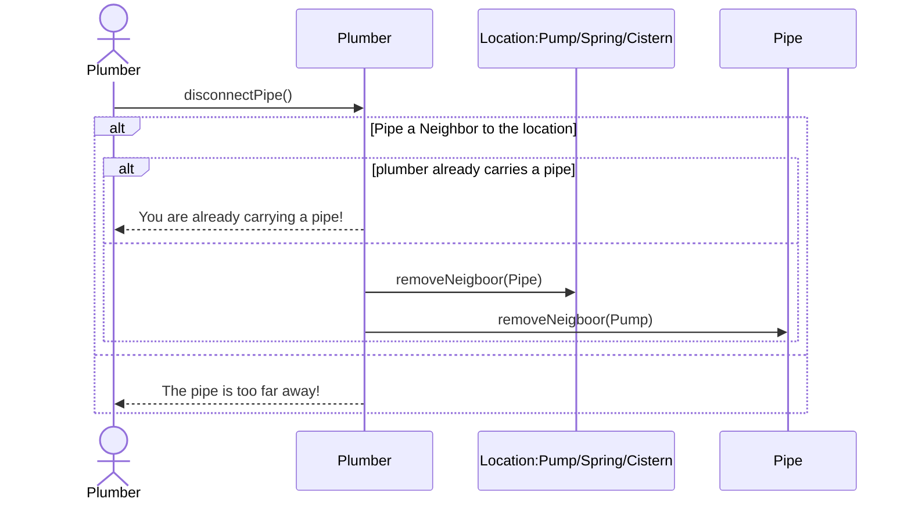
```mermaid
sequenceDiagram
    actor User as Plumber
    participant Plumber
    participant Location as Location:Pump/Spring/Cistern
    User->>Plumber: disconnectPipe()
    alt Pipe a Neighbor to the location
	    alt plumber already carries a pipe
		    Plumber-->>User: You are already carrying a pipe!
        else
	        Plumber->>Location: removeNeigboor(Pipe)
	         Plumber->>Pipe: removeNeigboor(Pump)
	        
        end
    else 
        Plumber-->>User: The pipe is too far away!
    end
```

# 2
5.2.2.1 Connect pipe with pump/spring/cistern
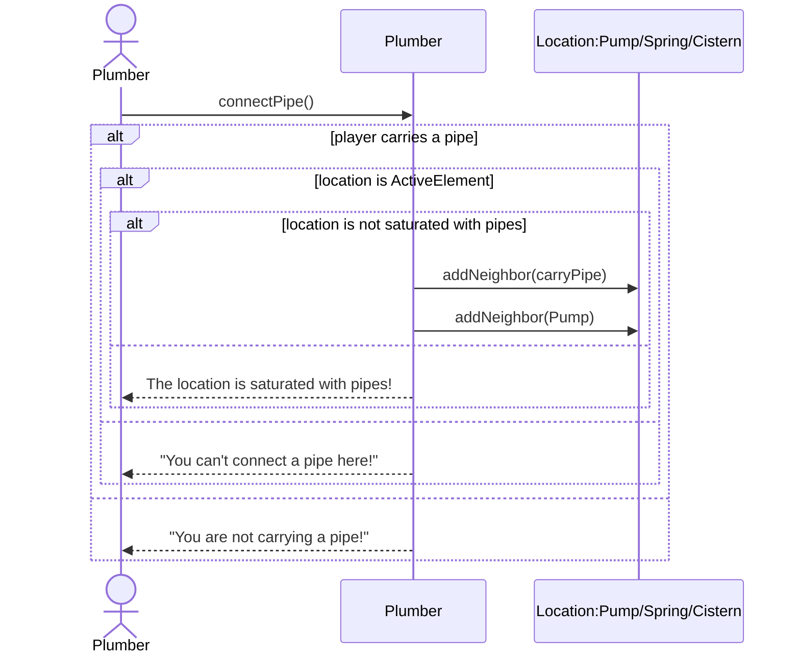
```mermaid
sequenceDiagram
    actor User as Plumber
    participant Plumber
    participant Location as Location:Pump/Spring/Cistern
    User->>Plumber: connectPipe()
    alt player carries a pipe
	    alt location is ActiveElement
		    alt location is not saturated with pipes
			    
		        Plumber->>Location: addNeighbor(carryPipe)
		        Plumber->>Location: addNeighbor(Pump)
		    else 
			    Plumber-->>User: The location is saturated with pipes!
		    end
	    else 
	        Plumber-->>User: "You can't connect a pipe here!"
	    end
	else 
		Plumber-->>User: "You are not carrying a pipe!"
	end
```

# 3
5.2.3.1 The Plumber fixes the pipe/pump
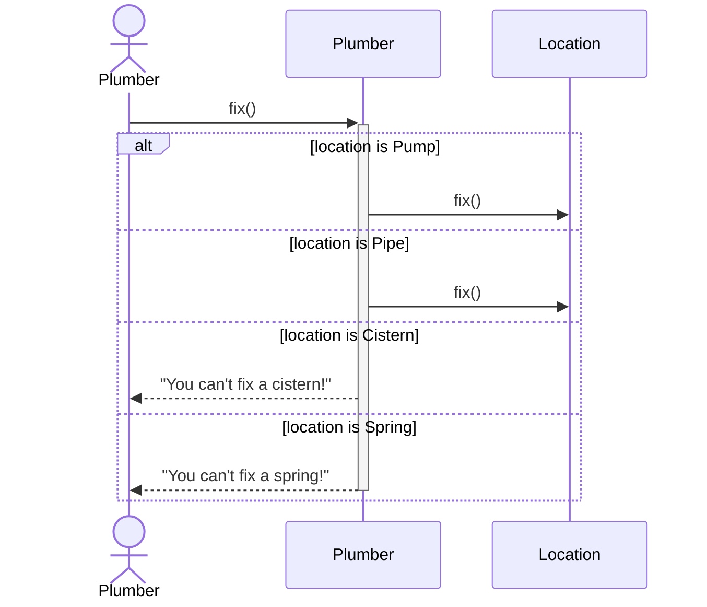
```mermaid
sequenceDiagram
    actor User as Plumber
    User->>+Plumber: fix()
    alt location is Pump
        Plumber->>Location: fix()
    else location is Pipe
	    Plumber->>Location: fix()
    else location is Cistern
        Plumber-->>User: "You can't fix a cistern!"
    else location is Spring
        Plumber-->>-User: "You can't fix a spring!"
    end
```
# 4
5.2.4.1 The Plumber/Saboteur changes the pump direction
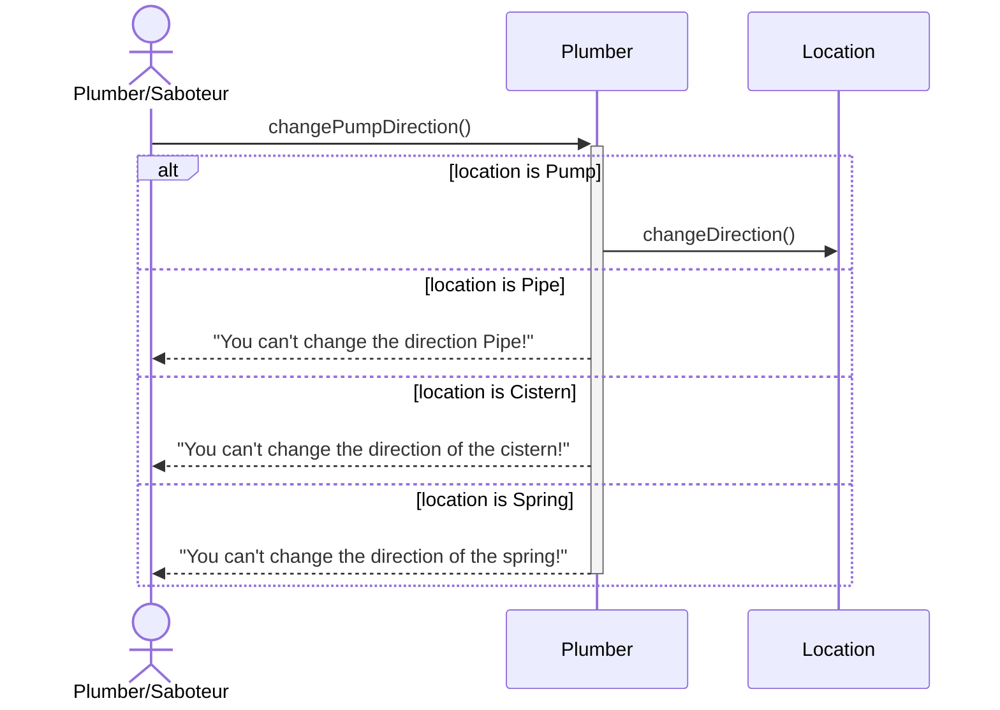
```mermaid
sequenceDiagram
    actor User as Plumber/Saboteur
    User->>+Plumber: changePumpDirection()
    alt location is Pump
        Plumber->>Location: changeDirection()
    else location is Pipe
	    Plumber-->>User: "You can't change the direction Pipe!"
    else location is Cistern
        Plumber-->>User: "You can't change the direction of the cistern!"
    else location is Spring
        Plumber-->>-User: "You can't change the direction of the spring!"
    end
```
# 5
5.2.4.1 The Plumber inserts the pump at a pipe
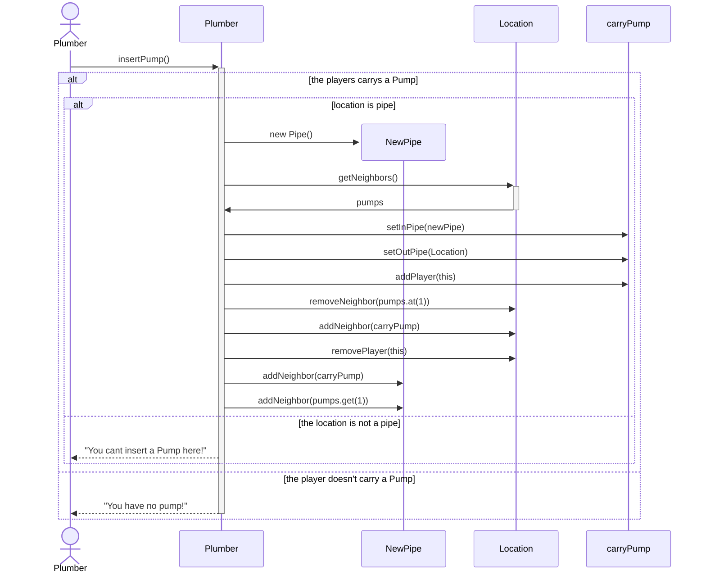
```mermaid
sequenceDiagram
    actor User as Plumber
    User->>+Plumber: insertPump()
	alt the players carrys a Pump
		alt location is pipe
			create participant NewPipe
			Plumber->>NewPipe: new Pipe()
			Plumber->>+Location: getNeighbors()
			Location->>-Plumber: pumps
			Plumber->>carryPump: setInPipe(newPipe)
			Plumber->>carryPump: setOutPipe(Location)
			Plumber->>carryPump: addPlayer(this)
			Plumber->>Location: removeNeighbor(pumps.at(1))
			Plumber->>Location: addNeighbor(carryPump)
			Plumber->>Location: removePlayer(this)
			Plumber->>NewPipe: addNeighbor(carryPump)
			Plumber->>NewPipe: addNeighbor(pumps.get(1))
		else the location is not a pipe
			Plumber-->>User: "You cant insert a Pump here!"
		end
    else the player doesn't carry a Pump
		Plumber-->>-User: "You have no pump!"
	end
	
```

# 6
5.2.6.1 The Plumber picks up the pump
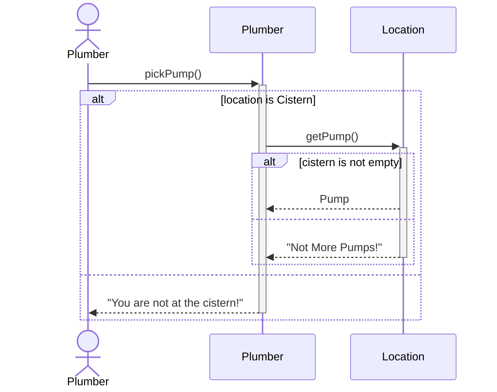
```mermaid
sequenceDiagram
    actor User as Plumber
    User->>+Plumber: pickPump()
    alt location is Cistern
        Plumber->>+Location: getPump()
        alt cistern is not empty
			Location-->>Plumber: Pump
        else 
	        Location-->>-Plumber: "Not More Pumps!"
        end
    else 
        Plumber-->>-User: "You are not at the cistern!"
    end
```
# 7
5.2.7.1 The Plumber picks up the pipe
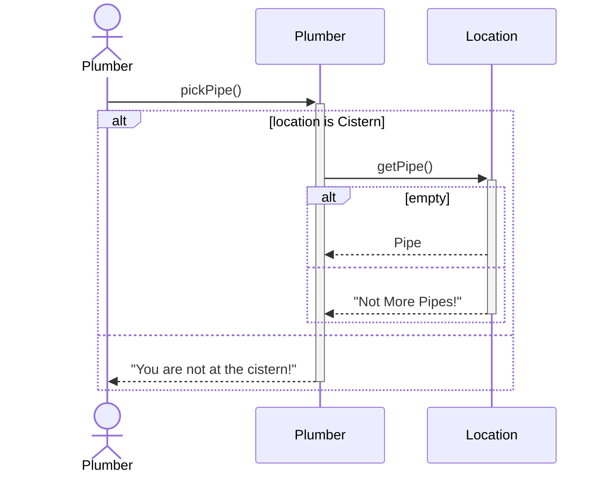
```mermaid
sequenceDiagram
    actor User as Plumber
    User->>+Plumber: pickPipe()
    alt location is Cistern
        Plumber->>+Location: getPipe()
        alt empty
			Location-->>Plumber: Pipe
        else 
	        Location-->>-Plumber: "Not More Pipes!"
        end
    else 
        Plumber-->>-User: "You are not at the cistern!"
    end
```

# 8

5.2.8.1 The Saboteur punctures the pipe
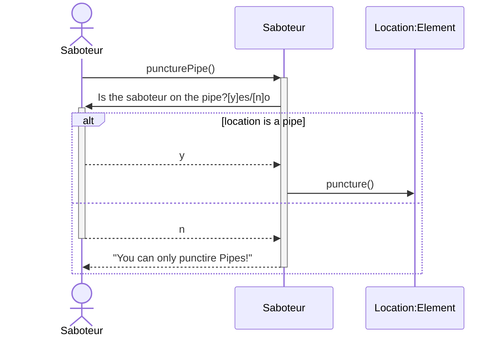
```mermaid
sequenceDiagram
    actor User as Saboteur
    participant P as Saboteur
    participant location as Location:Element
    User->>+P: puncturePipe()
    P->>+User: Is the saboteur on the pipe?[y]es/[n]o
    alt location is a pipe
	    User-->>P: y
	    P->>location: puncture()
    else 
	    User-->>-P: n
        P-->>-User: "You can only punctire Pipes!"
    end
```

# 9
5.2.9.1 The plumber/saboteur moves from pipe to pump/spring/cistern
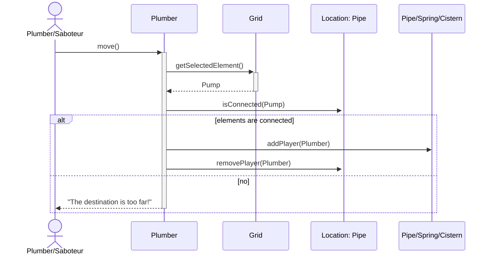
```mermaid
sequenceDiagram
    actor U as Plumber/Saboteur
    %%Player
    participant P as Plumber
    %%Grid
    participant G as Grid  
    %%Location
    participant L as Location: Pipe
    %%Destination
    participant D as Pipe/Spring/Cistern
    
    U->>+P: move()
    
    P->>+G: getSelectedElement()
	G-->>-P: Pump
	
	P->>+L: isConnected(Pump)
    alt elements are connected
	    P->>D: addPlayer(Plumber)
	    P->>L:removePlayer(Plumber)
    else no
	    P-->>-U: "The destination is too far!"
    end
```

5.2.9.2 The plumber/saboteur moves from pump/spring/cistern to pipe
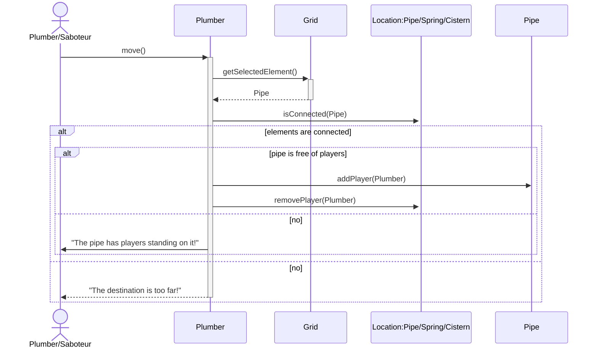
```mermaid
sequenceDiagram
    actor U as Plumber/Saboteur
    %%Player
    participant P as Plumber
    %%Grid
    participant G as Grid  
    %%Location
    participant L as Location:Pipe/Spring/Cistern 
    %%Destination
    participant D as Pipe
    
    U->>+P: move()
    
    P->>+G: getSelectedElement()
	G-->>-P: Pipe
	
	P->>+L: isConnected(Pipe)
    alt elements are connected
		alt  pipe is free of players
		    P->>D: addPlayer(Plumber)
		    P->>L:removePlayer(Plumber)
		else no
			P->>U:"The pipe has players standing on it!"
		end
    else no
	    P-->>-U: "The destination is too far!"
    end
```

# 10
5.2.10.1 Flowing water through pipe by pump/cistern/spring
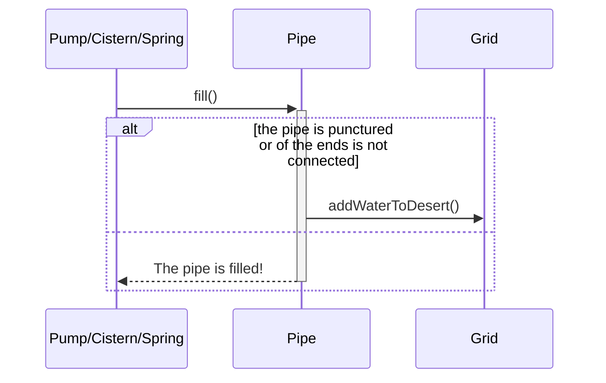
```mermaid
sequenceDiagram
	%%Active Element
	participant A as Pump/Cistern/Spring
    A->>+Pipe: fill()
    alt the pipe is punctured or of the ends is not connected
	    Pipe->>Grid: addWaterToDesert()
	else 
		Pipe-->>-A: The pipe is filled!
	end
```
5.2.10.2 Calculation of the flow at a spring
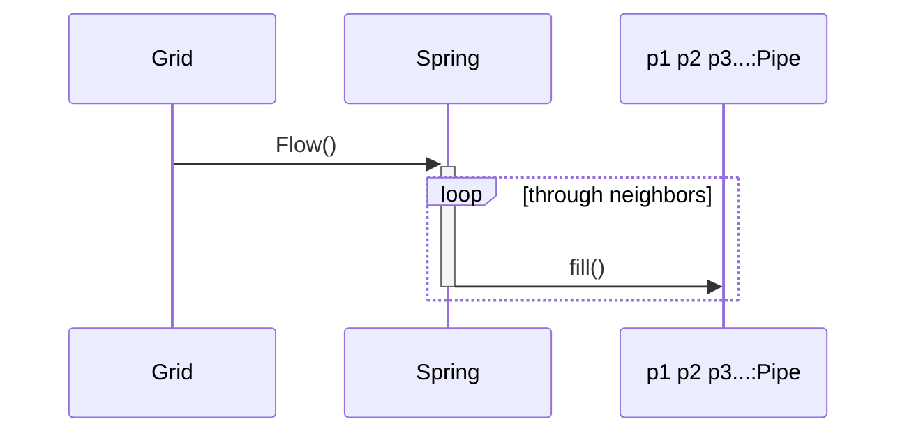
```mermaid
sequenceDiagram
	participant Grid
	participant Spring
	participant Pipe as p1 p2 p3...:Pipe
    Grid->>+Spring: Flow()
	loop through neighbors
	    Spring->>-Pipe: fill()
	end
```
5.2.10.3 Calculation of the flow at a pump
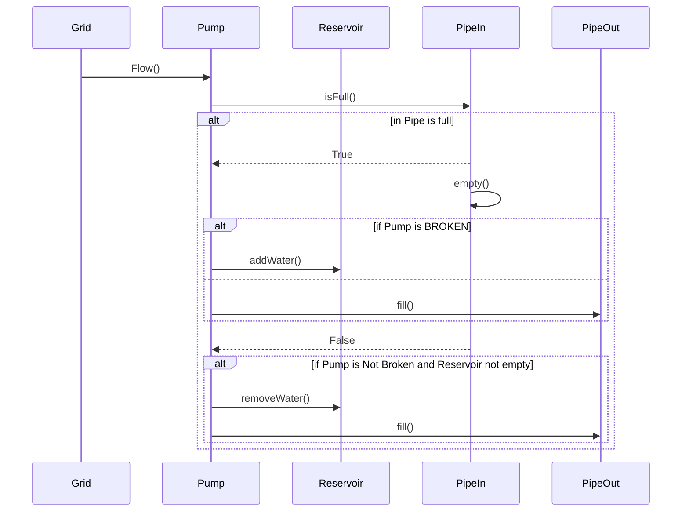
```mermaid
sequenceDiagram
	participant Grid
    participant Pump
    participant Reservoir
    participant PipeIn
    participant PipeOut
    Grid->>Pump: Flow()
	Pump->>PipeIn: isFull()
    alt in Pipe is full
        PipeIn-->>Pump: True
        PipeIn->>PipeIn: empty()
        alt if Pump is BROKEN
            Pump->>Reservoir: addWater()
        else
            Pump->>PipeOut: fill()
        end
        PipeIn-->>Pump: False
        alt if Pump is Not Broken and Reservoir not empty
            Pump->>Reservoir: removeWater()
            Pump->>PipeOut: fill()
        end
    end
```
5.2.10.4 Calculation of the flow at a cistern
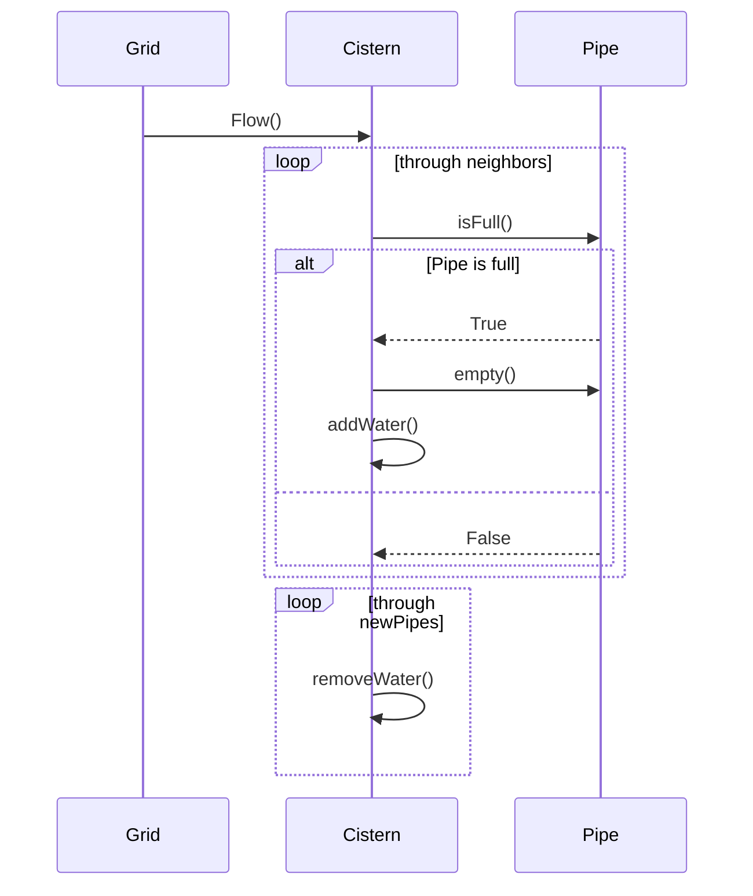
```mermaid
sequenceDiagram
	participant Grid
    participant Element as Cistern
    participant Pipe
	Grid->>Element: Flow()
    loop through neighbors
        Element->>Pipe: isFull()
        alt Pipe is full
	        Pipe-->>Element: True
            Element->>Pipe: empty()
            Element->>Element: addWater()
        else
	        Pipe-->>Element: False
        end
	        
    end

    loop through newPipes
        Element->>Element: removeWater()
    end
```
5.2.10.5 Calculation of general flow
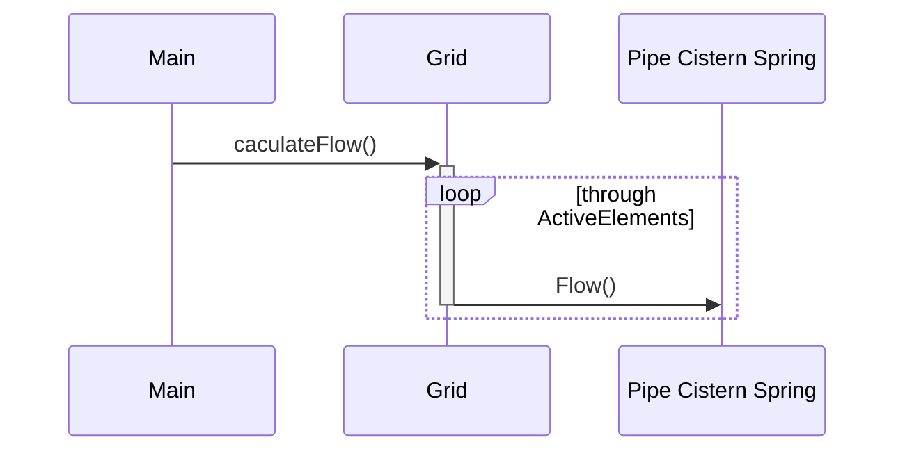
```mermaid
sequenceDiagram
	participant Main
    participant Grid
    participant ActiveElement as Pipe Cistern Spring
	Main->>+Grid: caculateFlow();
	loop through ActiveElements
        Grid->>-ActiveElement: Flow()
    end
```

# 11
5.2.11.1 Select pipe
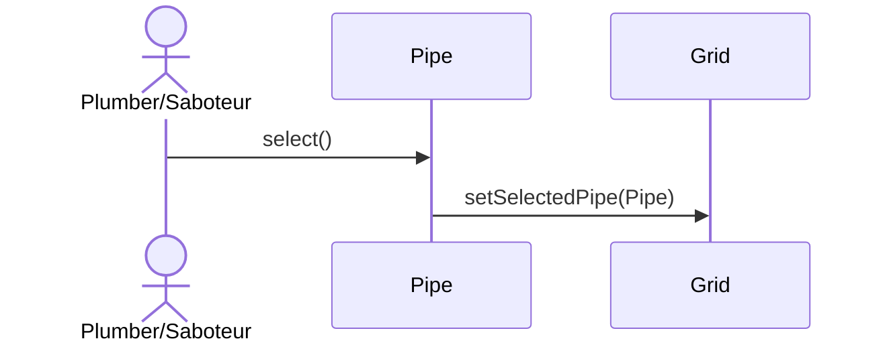
```mermaid
sequenceDiagram
	actor user as Plumber/Saboteur
	user->>Pipe: select()
	Pipe->>Grid: setSelectedPipe(Pipe)
```

5.2.11.2 Select pump/string/cistern
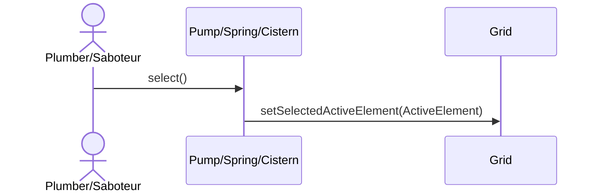
```mermaid
sequenceDiagram
	actor user as Plumber/Saboteur
	participant A as Pump/Spring/Cistern
	user->>A: select()
	A->>Grid: setSelectedActiveElement(ActiveElement)
```

# 12
5.2.12.1 Start application
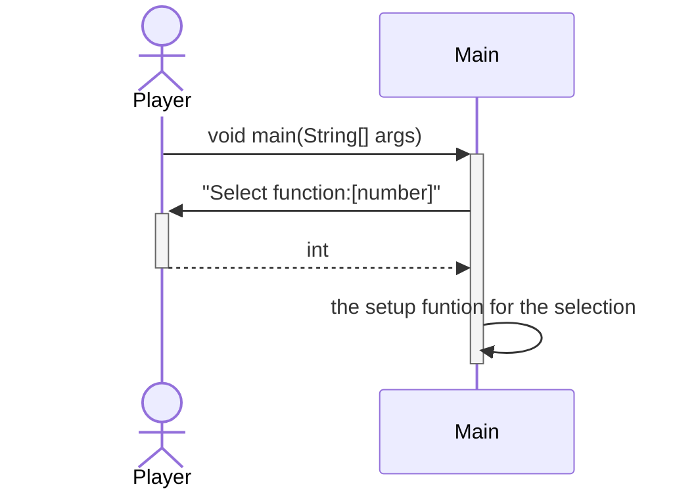
```mermaid
sequenceDiagram
	actor Player
	participant Main
	Player->>+Main: void main(String[] args)
	Main->>+Player: "Select function:[number]"
	Player-->>-Main: int
	Main->>-Main: the setup funtion for the selection
```

# 13
5.2.13.1 The user starts the game
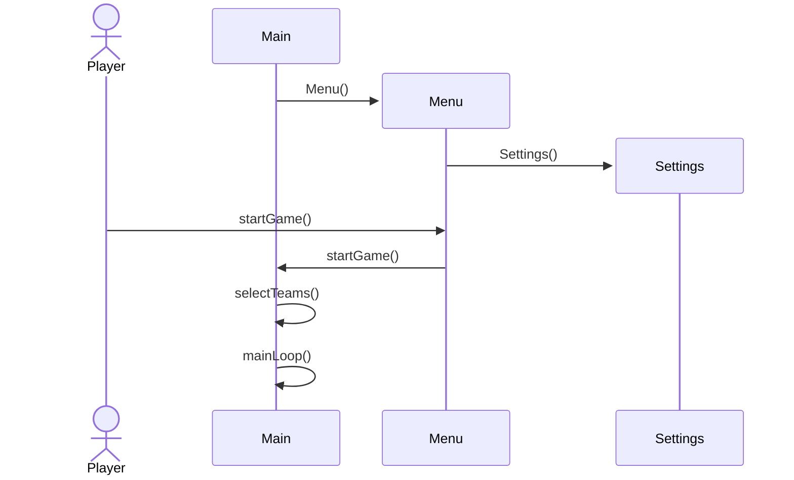
```mermaid
sequenceDiagram
	actor Player
	participant Main
	create participant Menu
	Main->>Menu: Menu()
	create participant Settings
	Menu->>Settings: Settings()
	Player->>Menu: startGame()
	Menu->>Main: startGame()
	Main->>Main: selectTeams()
	Main->>Main: mainLoop()
```
5.2.13.1 The user changes the settings
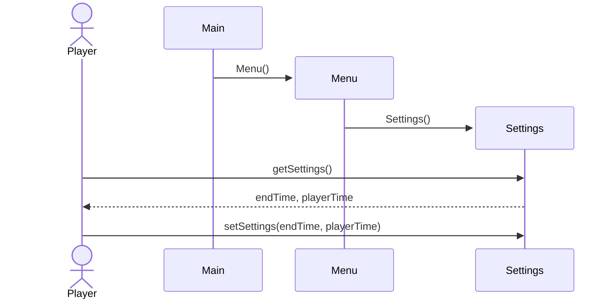
```mermaid
sequenceDiagram
	actor Player
	participant Main
	create participant Menu
	Main->>Menu: Menu()
	create participant Settings
	Menu->>Settings: Settings()
	Player->>Settings: getSettings()
	Settings-->>Player: endTime, playerTime 
	Player->>Settings: setSettings(endTime, playerTime)
```

# 14
  
5.2.14.1. Adding Player into the Plumber/Saboteur team of the game
```mermaid
sequenceDiagram
    actor User
    participant System as Main
    participant P as PlayersCollection
    
    System ->> +User:  "Select the team: [P]lumber/[S]aboteur"
    User -->> -System: [P/S]
    
    System ->> +User: Enter the name of the 1st plumber/saboteur
    User -->> -System: [string]
    
    create participant Player1
	System ->> Player1: Player([string])
    System ->> P: add(Player1)
    
    
    System ->>+ User: Enter the name of the 2nd plumber/saboteur
    User -->>-System: [string]
    
    System ->>+ User: Is [string] added before? [y]es/[n]o
    alt yes
	    User -->> System: y
	    System -->> User: The name has been added before
	else no
	    User -->> -System: n
	    
		create participant Player2
		System ->> Player2: Player([string])
	    System ->> P: add(Player2)
	end
	
	System ->> +User: Do you want to add more players?[y]es/[n]o
	alt yes
	    User ->> System: y
	    System ->> User: Enter the name of the 3nd plumber/saboteur
	    User ->> System: [string]
	    System ->> User: Is [string] added before? [y]es/[n]o
	    alt yes
	    	User -->> System: y
		    System -->> User: The name has been added before
		else no
		    User ->> System: n
		    
		    create participant Player3
			System ->> Player3: Player([string])
		    System ->> P: add(Player3)
		end
		loop this loops until it ends
			System ->>  User: Do you want to add more players?[y]es/[n]o
		end
	else no
		User ->> -System: n
	end
```

# 15
5.2.15.1 The main loop of the game
```mermaid
sequenceDiagram
	Main->>+Main: mainLoop()
    loop until game timer ends
        Main->+PlayresCollection: selectRandom()
        PlayresCollection-->>-Main: random player
        Main->>Player: active()
        loop until player timer ends
	        Note right of Main: timer ends here
        end
        Main->>Player: pasive()
    end
    Main->>-Main: endGame()
```

# 16
5.2.16.1. The game end and the display of results
```mermaid
sequenceDiagram
    Main->>Main: endGame()
    Main->>+Grid: getWaterAtDesert()
    Grid-->>-Main: saboteur result
    Main->>+Grid: getWaterAtCistern()
    Grid->>+Cistern: getWaterAmount()
    Cistern->>-Grid: waterAmount
    Grid-->>-Main: plumber result
    Main->>Main: displayResults()
```

- [x] Connect Pipe:: Disconnect Pipe :: Put Pump in Pipe
- [x] Connect New Pipe
- [x] Fix Grid :: Fix Broken Pump::Repair Leaking Pipe
- [x] Change Pump Direction
- [x] Insert Pump
- [x] Pick Up Pump
- [x] Pick up New Pipe at Cistern
- [x] Puncture Pipe
- [x] Move
- [x] Calculation :: Leakage of water
- [x] Select Elements
- [x] Main Menu :: Start game :: Change Settings
- [x] Select Teams :: Main Loop
- [x] End Game 