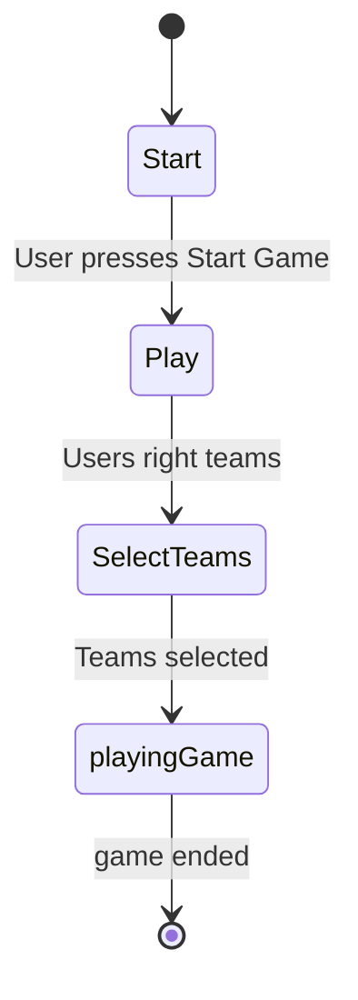
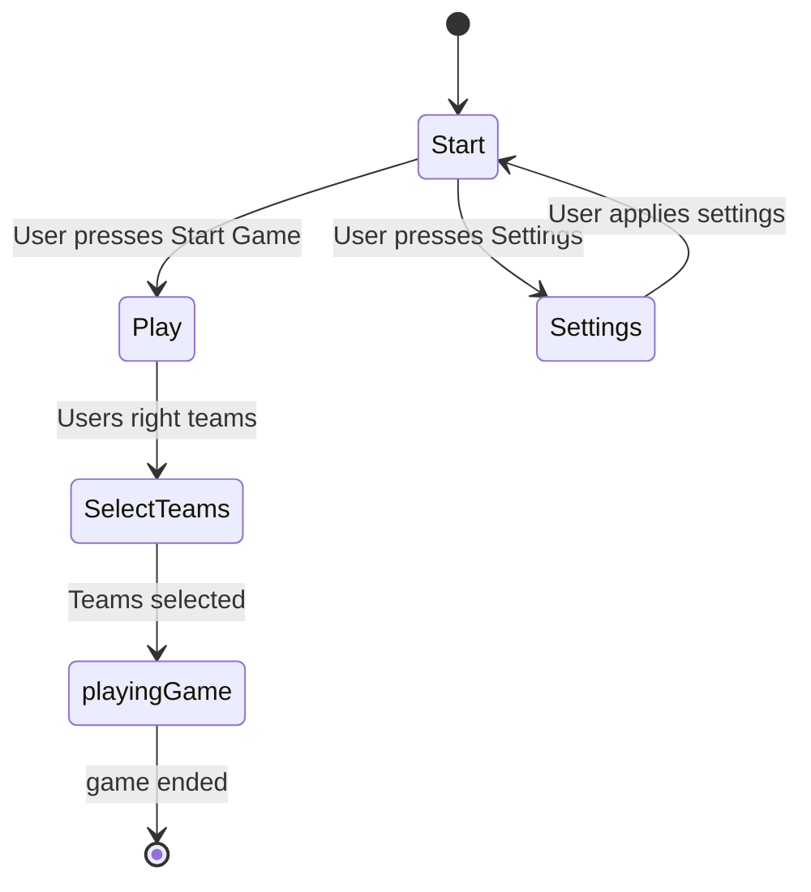
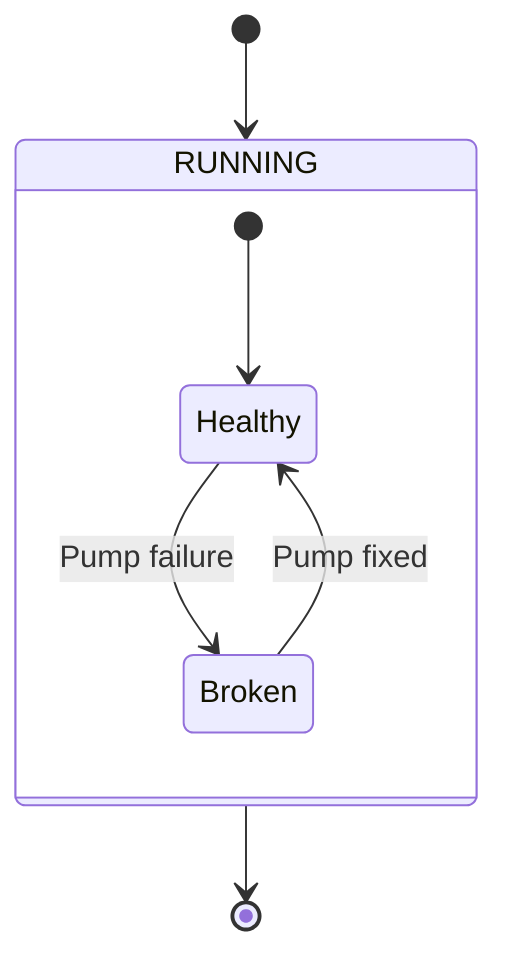
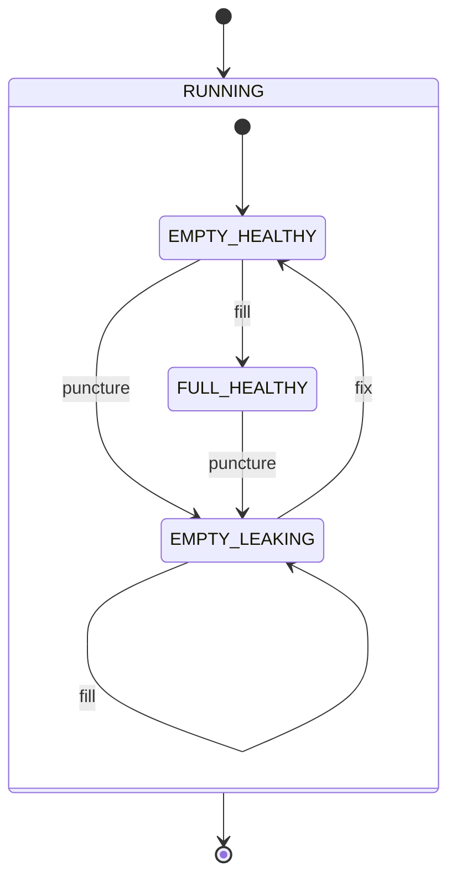

```mermaid
stateDiagram
    [*] --> Start
    Start --> Play: User presses Start Game
    Play --> SelectTeams: Users right teams
    SelectTeams --> playingGame: Teams selected
    playingGame --> [*]: game ended

```

```mermaid
stateDiagram
    [*] --> Start
    Start --> Play: User presses Start Game
    Start --> Settings: User presses Settings
    Settings --> Start: User applies settings
    Play --> SelectTeams: Users right teams
    SelectTeams --> playingGame: Teams selected
    playingGame --> [*]: game ended

```

```mermaid
stateDiagram
	[*] --> RUNNING
	state RUNNING {
		[*] --> Healthy
	    Healthy --> Broken: Pump failure
	    Broken --> Healthy: Pump fixed
	}
    RUNNING --> [*]

```

```mermaid
stateDiagram
	[*] --> RUNNING
	state RUNNING {
		[*] --> EMPTY_HEALTHY
	    EMPTY_HEALTHY --> FULL_HEALTHY: fill
	    EMPTY_HEALTHY --> EMPTY_LEAKING: puncture
	    EMPTY_LEAKING --> EMPTY_LEAKING: fill
	    EMPTY_LEAKING --> EMPTY_HEALTHY: fix
	    FULL_HEALTHY --> EMPTY_LEAKING: puncture
	}
    RUNNING --> [*]
```
